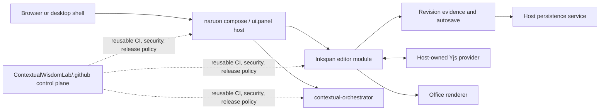
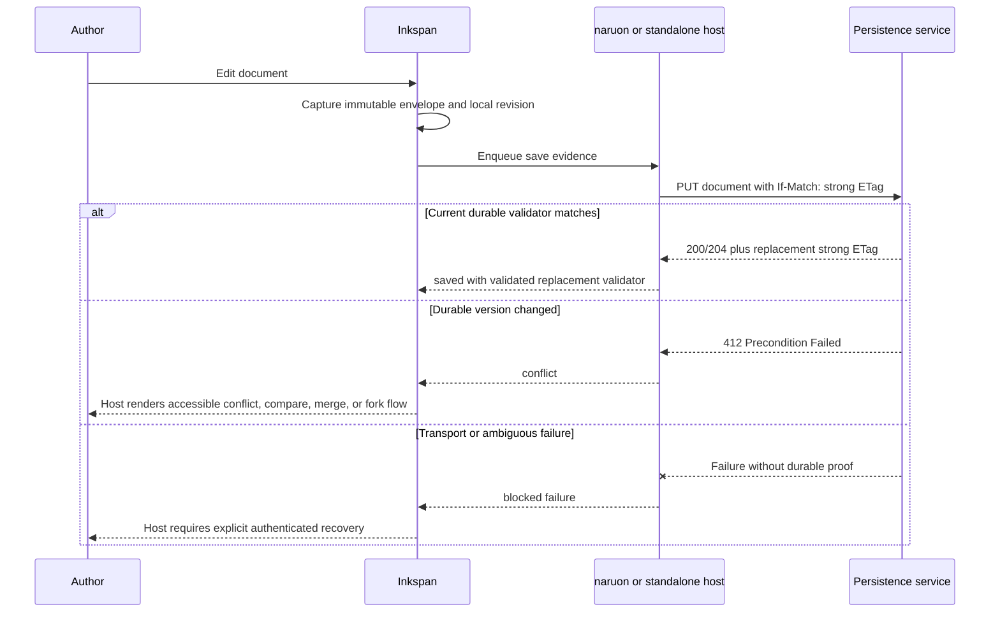

# Inkspan Architecture

Inkspan is a standalone authoring product and an embeddable module for CWL
applications. The architecture deliberately separates deterministic editor and
conversion behavior from host-owned transport, identity, tenancy, persistence,
and model policy so the same package can run independently or inside a modular
MSA composition.

## Standalone product boundary

Inkspan owns editor and deterministic conversion surfaces.

The standalone package provides:

- Markdown and HTML authoring through TipTap and ProseMirror;
- strict link and inline-image validation;
- SSR-safe React hydration;
- provider-neutral Yjs collaboration bindings;
- canonical versioned document envelopes and strict UTF-8 bytes;
- SHA-256 revision evidence and local revision-guarded restore;
- compact content-lineage evidence that binds validated previous and resulting
  revisions without embedding either document body;
- bounded single-flight autosave coordination and durable strong-validator
  session helpers;
- email serialization and framework-independent base64 conversion; and
- a network-free Office renderer for deterministic DOCX, XLSX, and PPTX output.

Hosts own transport, authorization, tenant isolation, persistence, credentials, migration, retention, and model-use policy.

Inkspan therefore never opens a production collaboration connection, chooses a
tenant, stores a provider secret, creates a durable database transaction, decides
a retention schedule, or authorizes an AI operation. A standalone adopter can
provide those capabilities directly; a CWL host can provide them through shared
platform services.

Document transition evidence proves only deterministic local revision equality
and ordering of the supplied previous and resulting envelopes. Host-owned
occurrence provenance—including actor identity, authenticated server time,
operation attribution, authorization, signatures, and durable acceptance—must
be recorded separately by the adopting service.

## Modular MSA composition

The modular boundary is intentionally additive. Importing Inkspan does not
require naruon or contextual-orchestrator, while a CWL host can compose all
three without replacing Inkspan's deterministic local contracts.

### Component responsibilities

| Component | Owns | Must not assume |
| --- | --- | --- |
| Inkspan | Editing, deterministic import/export, canonical envelopes, local revision evidence, local autosave ordering, accessible editor controls | User identity, tenant authority, durable commit success, provider credentials, retention, or model policy |
| ContextualWisdomLab/naruon | Product composition, route and panel lifecycle, authenticated host API calls, accessible conflict and recovery UX | That local Inkspan revision evidence is a server commit or authorization grant |
| ContextualWisdomLab/contextual-orchestrator | Provider-neutral model routing and host-approved model execution policy | Direct ownership of editor state, tenant persistence, or collaboration transport |
| ContextualWisdomLab/.github | Reusable CI, security, review, provenance, and release policy | Runtime authorization or tenant data access |
| Host persistence service | Atomic writes, server-selected strong validators, tenant isolation, migration, encryption, retention, audit storage | That browser-side checks replace server-side validation |
| Host collaboration service | Connection, room authorization, awareness policy, update persistence, provider lifecycle | That Inkspan may create or destroy the host provider |

## Data ownership matrix

| Data or evidence | Local Inkspan responsibility | Host responsibility | Shareability |
| --- | --- | --- | --- |
| Editor document | Validate and transform deterministically | Authorize access, persist, encrypt, migrate, retain | Private unless host policy explicitly permits sharing |
| Canonical envelope | Produce and validate exact schema/version bytes | Store, sign, classify, migrate, and apply retention | Usually private; contains the complete document |
| Local SHA-256 revision | Detect local equality and guard local restore | Never treat as authorization or durable commit evidence | Metadata only under tenant policy |
| Document transition evidence | Bind validated previous and resulting local revisions without document bodies | Add authenticated actor, time, operation, authorization, signature, and durable-result provenance | Metadata only under tenant policy; cryptographic digests can still be correlatable |
| Server-selected strong `ETag` | Validate syntax before use in a session | Select atomically and enforce `If-Match` in the write transaction | Tenant-confidential concurrency metadata |
| Yjs updates and awareness | Bind the supplied `Y.Doc` to the editor | Authorize rooms, transport, persist, redact, expire, and destroy providers | Host policy decides |
| Model prompt and output | Insert or restore validated results | Approve model use, credentials, redaction, routing, logging, and retention | Host policy decides |
| Release evidence | Expose deterministic tests and package contracts | Verify CI, provenance, approvals, and publication policy | Shareable only after secrets and tenant data are excluded |

## Optimistic-concurrency sequence

Inkspan coordinates local ordering, but the host service remains the only source
of durable success. The host returns a new server-selected strong `ETag` after
each accepted write. A local revision digest is never substituted for that
validator.

## SSR and panel lifecycle

A server-rendered host may render Inkspan's deterministic shell, but the
interactive editor, browser-only provider, and `Y.Doc` must be created in a
client boundary. In a Next.js App Router integration, naruon should keep the
`'use client'` boundary as small as practical and pass only serializable,
non-secret configuration into the panel. Provider secrets remain server-side.

The host owns provider creation and destruction. Inkspan may subscribe to the
supplied document and awareness state, but it must not create or destroy the
host provider. This allows one panel to mount and unmount without terminating a
provider shared by other product surfaces.

## Security and privacy boundaries

- Fail closed on malformed envelopes, unsafe links, external or active image
  sources, invalid validators, unsupported versions, and ambiguous save results.
- Do not place full envelopes, conflict bodies, prompts, model output, provider
  keys, access tokens, or tenant identifiers in ordinary logs or metrics.
- Treat local equality evidence separately from authenticated, shareable release
  or audit evidence.
- Keep collaboration authorization, persistence authorization, and model-use
  authorization independent even when the same user initiates all three.
- Pin reusable workflow sources immutably and require exact-head CI, security,
  packaging, provenance, and independent review before release publication.
- Do not claim WCAG, OWASP ASVS, NIST, ISO, or protocol conformance from this
  architecture document alone; verification belongs to the complete host and
  deployed product.

## Acquisition evidence boundary

An acquisition reviewer should be able to verify the product without receiving
private tenant content or production credentials. Shareable evidence includes:

- source, licenses, dependency locks, SBOMs, immutable workflow pins, and release
  provenance;
- exact-head unit, integration, security, accessibility, packaging, and release
  results;
- public API declarations, architecture and operator records, migration
  contracts, and rollback procedures; and
- deterministic fixtures that contain no customer data.

Local-only or restricted evidence includes production documents, conflict
bodies, Yjs updates, awareness metadata, provider credentials, authorization
claims, private model prompts and outputs, tenant-scoped validators, and
security findings that expose exploitable deployment detail.

The authoritative naruon composition guide is
[`docs/naruon-compose-ui-panel.md`](docs/naruon-compose-ui-panel.md). Standards,
claim boundaries, and decision history are recorded in
[`docs/doctoring/naruon-modular-architecture.md`](docs/doctoring/naruon-modular-architecture.md).
