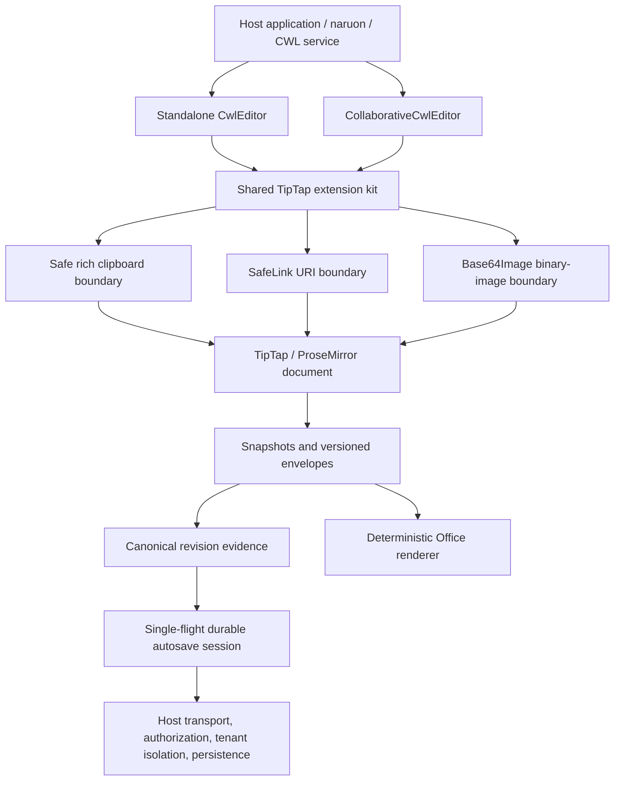
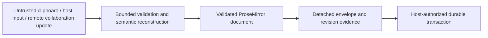

# Inkspan Architecture

Inkspan is a modular rich-document engine that can run as a standalone React
editor or as a provider-neutral Yjs collaboration module. The repository keeps
probabilistic, transport, persistence, identity, and tenant policy outside the
editor while supplying deterministic document, safety, accessibility, and
interoperability contracts.

## Module boundaries

### Interactive editor graph

- `src/components/` owns standalone React lifecycle, form integration,
  accessibility attributes, editor callbacks, and imperative handles.
- `src/collaboration/` owns the provider-neutral Yjs editor and public presence
  projection. Hosts own network/provider lifecycle and authorization.
- `src/extensions/` owns shared ProseMirror ingress and transaction policies.

### Deterministic document graph

- `documentEnvelope*` owns versioned, resource-bounded, duplicate-name-safe
  structural persistence.
- `documentRevisionEvidence*` owns RFC 8785 canonical bytes and SHA-256 equality
  evidence.
- `autosave/` owns bounded process-local scheduling and server-validator handoff,
  not durable storage or transport.
- `office/` owns network-free JSON-to-DOCX/XLSX/PPTX rendering.

### Trust boundaries

Untrusted content never receives authority from its text or markup. Clipboard
HTML is parsed into an inert tree and reconstructed through a positive allowlist;
unsafe links, resource-bearing HTML images, active elements, hidden content,
and unbounded structures fail closed. Direct document writes and collaboration
updates remain protected by active-schema, SafeLink, and inline-image policies.

## Ownership matrix

| Concern | Inkspan | Host or integrating service |
| --- | --- | --- |
| Editor schema and deterministic serialization | Owns | Consumes |
| Clipboard, link, and inline-image ingress policy | Owns | Chooses documented limits and UX |
| Accessibility semantics and document callbacks | Owns | Supplies labels, errors, and workflow |
| Local collaboration binding | Owns | Owns Yjs document/provider lifecycle |
| Local single-flight autosave ordering | Owns | Chooses enqueue/debounce timing |
| Network, credentials, authentication | Does not own | Owns |
| Authorization and tenant isolation | Does not own | Owns |
| Durable persistence and atomic compare/commit | Does not own | Owns |
| Migration, retention, backup, residency, audit | Does not own | Owns |
| LLM/provider selection and model-use policy | Does not own | Owns |

## Compatibility requirements

- Standalone operation must not require naruon or any central CWL service.
- Integration surfaces must remain narrow enough for naruon compose, `ui.panel`,
  contextual-orchestrator, and other repositories to provide host policy without
  forking Inkspan.
- Framework-independent package subpaths must remain free of React, TipTap UI,
  ProseMirror UI, Yjs, DOM, provider SDK, network, and credential dependencies
  unless their documented contract explicitly requires one.
- Database objects are host-owned. New objects must use at least two descriptive
  words and prefer `snake_case`.
- Default behavior changes require a minor version and a verified release-only
  pull request after feature integration.

## Quality gates

Every production change is expected to maintain:

- 100% production statement, branch, function, and line coverage;
- complete public module, type, class, method, function, and property docs;
- realistic security, interoperability, concurrency, and package-consumer tests;
- deterministic builds and package contents;
- exact-current-head CI, SAST, security, automated review, independent approval,
  and branch protection;
- `CHANGELOG.md`, operator docs, and APA 7 doctoring where standards or research
  materially inform the design.
