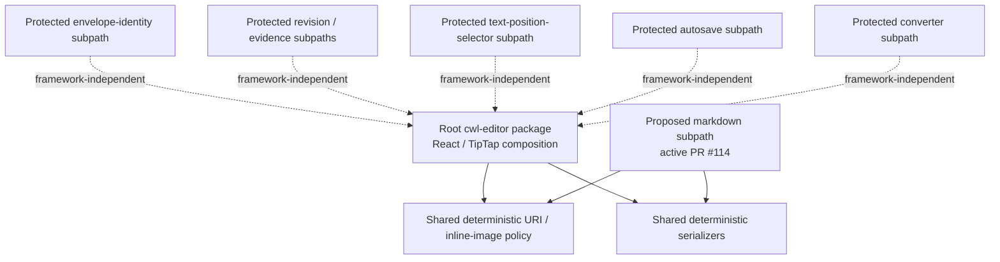
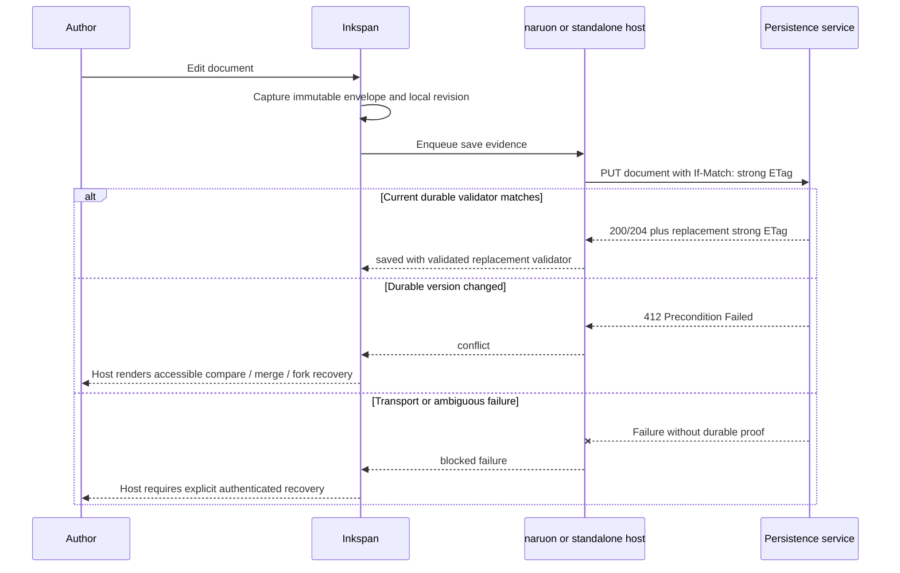

# Inkspan Architecture

Inkspan is a standalone authoring product and an embeddable module for CWL applications. The architecture deliberately separates deterministic editor, conversion, evidence, package, and presentation behavior from host-owned transport, identity, tenancy, persistence, collaboration-provider lifecycle, durable audit, and model policy so the same package can run independently or inside a modular MSA composition.

Protected `main` is implementation authority. Active PRs and Proposed ADRs are architecture targets only until protected integration.

## Standalone product boundary

Inkspan owns editor and deterministic conversion surfaces. Local evidence, package topology, and presentation contracts remain separate bounded responsibilities.

The protected standalone product provides:

- Markdown and HTML authoring through TipTap and ProseMirror;
- strict link and inline-image validation;
- SSR-safe React hydration and native-form integration;
- provider-neutral Yjs collaboration bindings;
- canonical versioned document envelopes and strict UTF-8 bytes;
- SHA-256 revision evidence and local revision-guarded restore;
- revision-scoped structural selection and W3C text-position evidence;
- a React-free text-position projection package surface;
- compact content-lineage evidence that binds validated previous and resulting revisions without embedding either document body;
- bounded single-flight autosave coordination and durable strong-validator session helpers;
- deterministic Markdown/HTML/email/plain-text conversion through the current protected package authority;
- framework-independent base64 conversion;
- dependency-locked Chromium/Firefox/WebKit rich-clipboard release assurance; and
- a network-free Office renderer for deterministic DOCX, XLSX, and PPTX output.

A named editor-chrome theme-token catalog and Storybook inventory for repeating toolbar/editor objects are Active PR / Proposed. Hosts override `--cwl-*` on `.cwl-editor`; Inkspan does not own Figma Variables, brand certification, or design-tool sync.

Hosts own transport, authorization, tenant isolation, persistence, credentials, migration, retention, and model-use policy. They also own authentication, deployment, durable audit, print destination policy, and any durable PDF/print-service authority; persistence includes durable storage and commit authority.

Inkspan therefore never opens a production collaboration connection, chooses a tenant, stores a provider secret, creates a durable database transaction, decides a retention schedule, authorizes an AI operation, or claims that a browser print destination constitutes a durable authorized export. A standalone adopter can provide those capabilities directly; a CWL host can provide them through shared platform services.

Document transition and selection/text-position evidence prove only deterministic local content/coordinate facts. This is host-owned occurrence provenance: host-owned systems must record actor identity, authenticated server time, operation attribution, authorization, signatures, durable acceptance, annotation identity/publication, and cross-revision re-anchoring separately from Inkspan's local evidence.

## Public package topology

Inkspan uses explicit package boundaries rather than treating every source module as a public API. The root package is the interactive composition surface; narrow subpaths expose bounded framework-independent capabilities where the product contract requires them.

The active `@contextualwisdomlab/cwl-editor/markdown` work in PR #114 is governed by Proposed ADR 0020. Its purpose is dependency isolation, not a second serializer authority. Until that PR or a verified successor integrates, the proposed subpath is unshipped and the protected root package remains the public authority for those serializers.

A framework-independent subpath must prove its declared dependency boundary from the packed npm artifact under ESM, CommonJS, and strict TypeScript consumers. Source-level import shape alone is insufficient release evidence.

## Presentation and print authority

Inkspan owns the CSS rules it ships for its editor. It does not own the operating system print spooler, printer, browser's pagination implementation, downstream PDF storage, or host disclosure policy.

Protected `main` currently remains the stylesheet authority. Proposed ADR 0021 and active PR #116 define a CSS-only `@media print` boundary intended to:

- remove Inkspan-owned screen-only scroll/max-height clipping;
- hide toolbar, collaboration status, remote caret/cursor-label, and placeholder UI from printed document output;
- preserve authored document structures and links;
- use conservative paged-fragmentation hints; and
- keep links distinguishable without relying on color alone.

This proposed presentation line does **not** create a JavaScript print mode, PDF service, page-number/header/footer authority, timestamp/signature claim, persistence layer, network requirement, credential, or model dependency. Until #116 integrates, the new print behavior is not shipped.

## Modular MSA composition

The modular boundary is intentionally additive. Importing Inkspan does not require naruon or contextual-orchestrator, while a CWL host can compose all three without replacing Inkspan's deterministic local contracts.

### Component responsibilities

| Component | Owns | Must not assume |
| --- | --- | --- |
| Inkspan | Editing, deterministic import/export, canonical envelopes, local revision/selector evidence, local autosave ordering, public package topology, accessible editor controls, shipped CSS presentation | User identity, tenant authority, durable commit/export success, provider credentials, retention, durable PDF service, or model policy |
| ContextualWisdomLab/naruon | Product composition, route and panel lifecycle, authenticated host API calls, accessible conflict/recovery/export UX | That local Inkspan revision/selector evidence is a server commit, annotation authorization, or durable export grant |
| ContextualWisdomLab/contextual-orchestrator | Provider-neutral model routing and host-approved model execution policy | Direct ownership of editor state, tenant persistence, conversion truth, or collaboration transport |
| ContextualWisdomLab/.github | Reusable CI, security, review, provenance, and release policy | Runtime authorization or tenant data access |
| Host persistence service | Atomic writes, server-selected strong validators, tenant isolation, migration, encryption, retention, audit storage | That browser-side checks replace server-side validation |
| Host collaboration service | Connection, room authorization, awareness policy, update persistence, provider lifecycle | That Inkspan may create or destroy the host provider |
| Host print/export service, when present | Authorized durable PDF/artifact creation, storage, signatures/timestamps, retention and distribution | That Inkspan CSS alone proves a durable or archival export |

## Data ownership matrix

| Data or evidence | Local Inkspan responsibility | Host responsibility | Shareability |
| --- | --- | --- | --- |
| Editor document | Validate and transform deterministically | Authorize access, persist, encrypt, migrate, retain | Private unless host policy explicitly permits sharing |
| Canonical envelope | Produce and validate exact schema/version bytes | Store, sign, classify, migrate, and apply retention | Usually private; contains the complete document |
| Local SHA-256 revision | Detect local equality and guard local restore | Never treat as authorization or durable commit evidence | Metadata only under tenant policy |
| Structural selection / W3C selector evidence | Bind coordinates/projection to one exact revision without quote text | Authorize source/annotation use, persist/publish, re-anchor across revisions | Metadata only under tenant policy |
| Document transition evidence | Bind validated previous and resulting local revisions without document bodies | Add authenticated actor, time, operation, authorization, signature, and durable-result provenance | Metadata only under tenant policy; cryptographic digests can still be correlatable |
| Server-selected strong `ETag` | Validate syntax before use in a session | Select atomically and enforce `If-Match` in the write transaction | Tenant-confidential concurrency metadata |
| Yjs updates and awareness | Bind the supplied `Y.Doc` to the editor | Authorize rooms, transport, persist, redact, expire, and destroy providers | Host policy decides |
| Model prompt and output | Insert or restore validated results | Approve model use, credentials, redaction, routing, logging, and retention | Host policy decides |
| Browser print representation | Apply Inkspan-owned presentation CSS when supported | Authorize printing/export, choose destination, secure spool/storage, retain/distribute | Host/user policy decides |
| Release evidence | Expose deterministic tests and package contracts | Verify CI, provenance, approvals, registry configuration and publication policy | Shareable only after secrets and tenant data are excluded |

## Optimistic-concurrency sequence

Inkspan coordinates local ordering, but the host service remains the only source of durable success. The host returns a new server-selected strong `ETag` after each accepted write. A local revision digest is never substituted for that validator.

## SSR and panel lifecycle

A server-rendered host may render Inkspan's deterministic shell, but the interactive editor, browser-only provider, and `Y.Doc` must be created in a client boundary. In a Next.js App Router integration, naruon should keep the `'use client'` boundary as small as practical and pass only serializable, non-secret configuration into the panel. Provider secrets remain server-side.

The host owns provider creation and destruction. Inkspan may subscribe to the supplied document and awareness state, but it must not create or destroy the host provider. This allows one panel to mount and unmount without terminating a provider shared by other product surfaces.

## Security and privacy boundaries

- Fail closed on malformed envelopes, unsafe links, external or active image sources, invalid validators, unsupported versions, invalid selector projection boundaries, and ambiguous save results.
- Do not place full envelopes, selected quote text, conflict bodies, prompts, model output, provider keys, access tokens, tenant identifiers, or print destinations in ordinary logs or metrics.
- Treat local equality/location evidence separately from authenticated, shareable release, annotation, or audit evidence.
- Keep collaboration authorization, persistence authorization, annotation publication, print/export authorization, and model-use authorization independent even when the same user initiates all of them.
- Keep framework-neutral package subpaths free of ambient credentials/network/model authority unless an accepted versioned contract explicitly adds it.
- Pin reusable workflow sources immutably and require exact-head CI, security, packaging, provenance, and required independent review before release publication.
- OIDC registry workflow integration does not prove registry-side Trusted Publisher configuration; live publication remains operational evidence.
- Do not claim WCAG, OWASP ASVS, NIST, ISO, PDF/A, protocol, or archival conformance from this architecture document alone; verification belongs to the complete deployed product and applicable evidence.

## Acquisition evidence boundary

An acquisition reviewer should be able to verify the product without receiving private tenant content or production credentials. Shareable evidence includes:

- source, licenses, dependency locks, SBOMs, immutable workflow pins, package manifests, and release provenance;
- exact-head unit, integration, security, accessibility, browser, Office, packaging, and release results;
- public API/package declarations, architecture/operator records, migration contracts, and rollback procedures; and
- deterministic/synthetic fixtures that contain no customer data.

Local-only or restricted evidence includes production documents, selected quote text, conflict bodies, Yjs updates, awareness metadata, provider credentials, authorization claims, private model prompts/outputs, tenant-scoped validators, private print/export destinations, and security findings that expose exploitable deployment detail.

The authoritative naruon composition guide is [`docs/naruon-compose-ui-panel.md`](docs/naruon-compose-ui-panel.md). Standards, claim boundaries, and decision history are recorded in the doctoring and ADR corpus under `docs/doctoring/` and `docs/adr/`.
