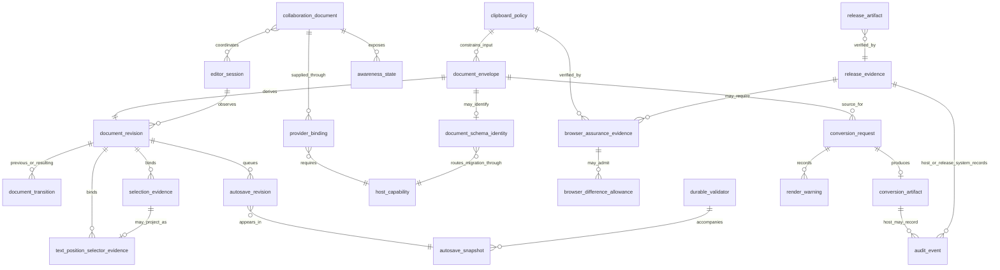

# Inkspan Conceptual Data and Evidence Model

Status: Protected-main canonical baseline

Inkspan does **not** own an application database in the current architecture. This document is a conceptual/logical model of runtime value objects, conversion/release evidence, and host-owned boundaries. It must not be read as physical DDL. Entities marked host-owned may be persisted by an embedding product, but their physical schema is outside Inkspan authority.

## Logical ERD

## Inkspan-owned in-memory or package value objects

- `document_envelope`: versioned, strictly validated, canonicalizable complete document value. It can contain the complete document body. Inkspan constructs/validates it; a host may persist it under its own policy.
- `document_schema_identity`: `implemented_on_protected_main` as a frozen identity-only routing value containing the complete envelope's bounded `schemaId` and positive safe-integer `schemaVersion`. It contains no document body and does not validate unsupported-version document semantics. The host owns migration selection/execution and persistence.
- `document_revision`: SHA-256 equality evidence derived from one exact canonical envelope. It is not authorization, tenant identity, actor identity, timestamp, signature, or proof of a durable write.
- `editor_session`: conceptual local editor/runtime lifetime. It binds one mounted editor state to local evidence and host callbacks. It is not a durable account/session record and has no authentication authority.
- `document_transition`: previous/resulting revision pair plus changed classification. It deliberately omits the document body from ordinary evidence.
- `selection_evidence`: ProseMirror structural coordinates bound to one exact revision. It is a local evidence value, not a durable cross-revision anchor.
- `text_position_selector_evidence`: `implemented_on_protected_main` as a frozen revision-scoped W3C `TextPositionSelector` plus explicit `inkspan-prosemirror-text` projection identity. It satisfies `0 <= start <= end <= projectedCodePointLength`; inclusive `start` and exclusive `end` count Unicode code points, boundaries are grapheme-validated, and ordinary evidence contains no selected quote text. It is not a durable cross-revision anchor, annotation identity, authorization record, timestamp, signature, or persistence receipt.
- `review_target` / `review_suggestion`: `implemented_on_active_pr` under Proposed ADR 0027. These are bounded revision-scoped target and insert/delete lifecycle values; operation results contain only revisions and compact transition evidence. They do not contain comment bodies or transfer host identity, authorization, persistence, collaboration, audit, or cross-revision re-anchoring authority.
- `autosave_revision`: detached immutable revision evidence accepted by the local single-flight autosave coordinator.
- `autosave_snapshot`: frozen document-free queue/session lifecycle metadata such as idle/saving/blocked/closing/closed and bounded pending state. The explicit in-process snapshot may also carry the bounded active/pending/last-saved strong-validator fields defined by the autosave contract; those fields are confidential local concurrency metadata rather than generic telemetry.
- `clipboard_policy`: bounded local policy describing the supported semantic rich-paste boundary. It grants no host network or tenant authority.
- `conversion_request`: versioned deterministic conversion intent. It identifies the supported source representation, requested target such as Markdown/HTML/DOCX/XLSX/PPTX, explicit output/publication options, and validated render configuration. It is a runtime value, not a durable job record.
- `conversion_artifact`: completed deterministic conversion result or artifact identity produced only after validation/build/publication succeeds. A partial/failed output is not a `conversion_artifact` success.
- `render_warning`: bounded structured warning or limitation attached to a supported conversion request/result when the contract permits warning-level evidence. It must not contain secrets or uncontrolled complete document bodies in generic telemetry.
- `release_artifact`: package/wheel/checksum or other expected artifact considered for release.
- `release_evidence`: exact-source artifact inventory/digest/provenance/verification evidence used before publication.

## Release-assurance evidence objects

The following **release-assurance evidence objects** describe the protected browser gate without implying that either value requires an application database:

- `browser_assurance_evidence`: `implemented_on_protected_main` as exact-head release evidence from the same committed synthetic rich-clipboard corpus executed in required Chromium, Firefox, and WebKit projects. It records bounded committed synthetic fixture/corpus identity, browser revisions, package-lock SHA-256 identity, fresh-run identity, exact packed npm artifact SHA-256 digest, platform, and source identity rather than tenant clipboard data. A non-synthetic corpus or non-SHA-256 artifact digest does not satisfy this evidence contract.
- `browser_difference_allowance`: `planned` unless and until a real standards-permitted browser serialization difference requires one focused reviewed explanation. It must be attached only to focused evidence with a standards basis, threat analysis, compatibility consequence, and rollback; it never acts as a generic normalization rule or approval substitute.

These values may remain ephemeral or release-artifact metadata. Their presence in the logical model does not create an Inkspan application database or transfer host authority.

## Host-owned conceptual entities and boundaries

- `durable_validator`: host/server-selected strong HTTP entity tag used for durable compare-and-swap. Inkspan validates/coordinates the value but does not select durable server state.
- `collaboration_document`: host-owned Yjs-compatible collaborative document state supplied to Inkspan. Room identity, tenant membership, persistence and retention remain host responsibilities.
- `awareness_state`: host/provider-governed ephemeral collaboration presence metadata. It can contain sensitive tenant information and is not authorization evidence.
- `provider_binding`: host-created connection/binding between an Inkspan collaboration adapter and a collaboration provider/document. Inkspan does not own credentials, reconnect policy, provider creation/destruction, or durable update storage.
- `host_capability`: conceptual set of explicitly supplied host capabilities such as durable save callback, authenticated API, collaboration provider, external model proposal surface, file-output authority, migration registry, annotation publication/re-anchoring, or naruon panel composition. Absence of a capability means Inkspan must not invent it.
- `audit_event`: host/release-system owned durable event for actor, authorization, durable save, migration, provider, security, annotation publication, or release activity. Inkspan local revisions/transitions/selectors/snapshots do not substitute for authenticated durable audit records.

## Ownership and lifecycle matrix

| Entity | Current physical persistence owner | Typical lifecycle | Contains complete document body? | Authority claim |
|---|---|---|---|---|
| `document_envelope` | host if persisted | document revision | yes | deterministic document value only |
| `document_schema_identity` | none required; `implemented_on_protected_main` | one routing inspection | no | schema-route metadata only |
| `document_revision` | local or host metadata by policy | derived per exact content | no | equality only |
| `editor_session` | none required | mounted editor runtime | may reference local state | no auth/session authority |
| `document_transition` | none required; host may store | change evidence | no | content-lineage evidence only |
| `selection_evidence` | none required | review/selection capture | no | exact-revision ProseMirror coordinates only |
| `text_position_selector_evidence` | none required; `implemented_on_protected_main` | interoperable review/annotation capture | no | exact-revision W3C text positions satisfying `0 <= start <= end <= projectedCodePointLength` under one versioned projection only |
| `review_target` / `review_suggestion` | none required; `implemented_on_active_pr` | inline review and deterministic suggestion operation | no | bounded revision-scoped metadata and local transition evidence only; host owns bodies, identity, authorization, persistence, audit, and re-anchoring |
| `autosave_revision` | none required | queued local save evidence | envelope-bearing evidence may be retained boundedly by queue | local save ordering only |
| `autosave_snapshot` | none required | lifecycle observation/coordination | no | local machine state only; validator fields remain confidential metadata |
| `durable_validator` | host | durable version | no | host concurrency evidence, not authorization |
| `collaboration_document` | host/provider | collaborative room/document | yes, as Yjs state | host/provider authority |
| `awareness_state` | host/provider | ephemeral presence | not normally document body | no authorization |
| `provider_binding` | host | mount/connection lifecycle | no | host connection capability |
| `host_capability` | host/runtime configuration | component mount | no | explicit capability only |
| `conversion_request` | none required | one deterministic conversion | may reference/contain requested source content | conversion intent only |
| `conversion_artifact` | caller/host filesystem or artifact store | successful render/export | yes, rendered form | successful deterministic output only |
| `render_warning` | none required; host may log under policy | conversion result | no by default | warning/limitation only |
| `browser_assurance_evidence` | release system if retained; `implemented_on_protected_main` | one exact-head browser gate | committed synthetic fixture metadata only | exact-source/lock/run/browser plus packed npm artifact SHA-256 release assurance only |
| `browser_difference_allowance` | release system if retained; planned | focused engine difference | no tenant content | reviewed safe-difference rationale only |
| `audit_event` | host/release system | durable operational history | should avoid complete body unless policy requires | authenticated host/release evidence |
| `release_artifact` | release system | build/release | package content | candidate artifact only |
| `release_evidence` | release system | exact-head publication | no tenant document content | artifact/source verification only |

## Temporal, tenant, provenance, and version dimensions

The current Inkspan runtime does not create a tenant database, but products embedding it depend on temporal/version provenance boundaries:

- `document_envelope` carries an explicit schema/version contract; unknown versions require host-owned migration routing rather than permissive parsing.
- protected-main `document_schema_identity` exposes only bounded routing metadata; it never validates or migrates the unsupported document body and never creates a durable version claim.
- `document_revision`, selection, text-position selector, transition, and autosave evidence bind to one exact content state; they do not add actor/time/tenant claims not present in the source contract.
- `text_position_selector_evidence` additionally binds interpretation to one explicit projection version and the range invariant `0 <= start <= end <= projectedCodePointLength`. A later projection version cannot reinterpret stored version-1 offsets, and a revision mismatch prevents direct cross-revision offset reuse.
- `durable_validator` is temporally ordered by the host's atomic persistence service and must advance only after validated durable success.
- `collaboration_document`, `provider_binding`, `awareness_state`, `host_capability`, and `audit_event` can be tenant-scoped in a host, but Inkspan does not define or infer that tenant key.
- protected-main `browser_assurance_evidence` and any future focused `browser_difference_allowance` bind to one exact source, committed synthetic corpus, package-lock SHA-256, fresh run identity, exact packed npm artifact SHA-256 digest, and browser revision set; predecessor, non-synthetic, differently digested, or different-browser evidence does not transfer silently.
- `release_evidence` binds package artifacts to one exact protected source generation; predecessor evidence does not transfer after source movement.

## Privacy and minimum-disclosure rules

Ordinary lifecycle/selection/text-position/transition/schema-identity evidence should remain document-free. Text-position evidence deliberately omits selected quote text and surrounding source text; a host that needs quote redundancy must derive it deliberately under its own authorization, classification, retention, and publication policy. Revision/entity tags, durable validators, selector offsets/projection identity, provider metadata, awareness state, schema identity, browser evidence, and host identifiers can still be tenant-confidential or release-sensitive metadata and **must never** become public high-cardinality metric labels or unauthenticated logs. Any separate sharing is limited to authenticated, purpose-bound, minimum-disclosure channels under host policy; such a channel does not create an exception for public metrics or unauthenticated logging. Complete document envelopes, Yjs state, conversion inputs/artifacts, prompts/model outputs, credentials, annotation bodies, and host authorization claims follow the host's purpose, encryption, retention, and access policy.

## Persistence non-applicability and future change

No Inkspan-owned relational schema is required by the current architecture, so no physical database ERD or migration set is invented here merely to satisfy documentation completeness. Protected identity-routing, text-position selector, and browser-assurance values are logical API/evidence objects, not database tables. If Inkspan later introduces durable persistence, that is a material architecture change requiring:

1. an Accepted ADR defining why persistence moved into Inkspan;
2. a physical database ERD with descriptive multiword `snake_case` object names;
3. tenant, temporal, provenance, retention, encryption, authorization, and audit semantics;
4. migrations, backup/restore and rollback/recovery design; and
5. a revised threat model, test strategy, operability runbook, and acquisition evidence package.
