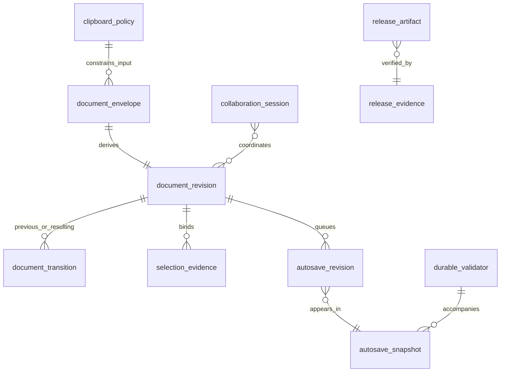

# Inkspan Conceptual Data and Evidence Model

Status: Proposed canonical baseline

Inkspan does not own an application database. This document is a conceptual/logical model of value objects and host boundaries; it must not be read as physical DDL.

## Entities

- `document_envelope`: versioned validated canonicalizable document value. In-memory/package value; host may persist it.
- `document_revision`: SHA-256 equality evidence derived from one validated canonical envelope. Value object, not authorization.
- `document_transition`: previous/resulting revision pair plus changed classification. Value object without document body.
- `selection_evidence`: ProseMirror structural coordinates bound to one exact revision. Value object, not a durable cross-revision anchor.
- `autosave_revision`: detached immutable revision evidence accepted by local autosave coordination.
- `autosave_snapshot`: frozen document-free queue/session lifecycle metadata.
- `durable_validator`: host/server-selected strong HTTP entity tag used for durable compare-and-swap. Host-owned concurrency evidence.
- `collaboration_session`: conceptual host/provider lifecycle around collaborative editor state. Provider/authorization/persistence are host-owned.
- `clipboard_policy`: bounded local policy controlling accepted rich clipboard semantics.
- `release_artifact`: package/wheel/checksum artifact considered for release.
- `release_evidence`: digest/inventory/provenance evidence used before publication.

## Ownership

Inkspan owns deterministic construction and validation of its value objects. Hosts own durable identifiers, actors, tenants, timestamps, storage records, credentials, audit events, authorization decisions, retention and migrations unless a future explicit versioned contract states otherwise.

## Persistence non-applicability

No Inkspan-owned relational schema is required by the current architecture. If Inkspan later introduces durable persistence, that is a material architecture change requiring an ADR, migration/rollback design, security review and a physical ERD distinct from this conceptual model.
