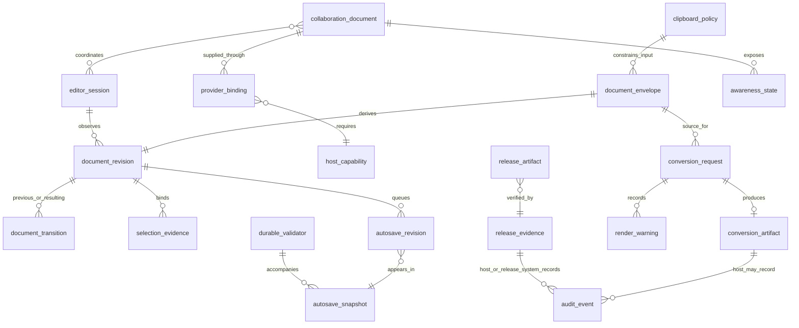

# Inkspan Conceptual Data and Evidence Model

Status: Proposed canonical baseline

Inkspan does **not** own an application database in the current architecture. This document is a conceptual/logical model of runtime value objects, conversion/release evidence, and host-owned boundaries. It must not be read as physical DDL. Entities marked host-owned may be persisted by an embedding product, but their physical schema is outside Inkspan authority.

## Logical ERD

## Inkspan-owned in-memory or package value objects

- `document_envelope`: versioned, strictly validated, canonicalizable complete document value. It can contain the complete document body. Inkspan constructs/validates it; a host may persist it under its own policy.
- `document_revision`: SHA-256 equality evidence derived from one exact canonical envelope. It is not authorization, tenant identity, actor identity, timestamp, signature, or proof of a durable write.
- `editor_session`: conceptual local editor/runtime lifetime. It binds one mounted editor state to local evidence and host callbacks. It is not a durable account/session record and has no authentication authority.
- `document_transition`: previous/resulting revision pair plus changed classification. It deliberately omits the document body from ordinary evidence.
- `selection_evidence`: ProseMirror structural coordinates bound to one exact revision. It is a local evidence value, not a durable cross-revision anchor.
- `autosave_revision`: detached immutable revision evidence accepted by the local single-flight autosave coordinator.
- `autosave_snapshot`: frozen document-free queue/session lifecycle metadata such as idle/saving/blocked/closing/closed and bounded pending state.
- `clipboard_policy`: bounded local policy describing the supported semantic rich-paste boundary. It grants no host network or tenant authority.
- `conversion_request`: versioned deterministic conversion intent. It identifies the supported source representation, requested target such as Markdown/HTML/DOCX/XLSX/PPTX, explicit output/publication options, and validated render configuration. It is a runtime value, not a durable job record.
- `conversion_artifact`: completed deterministic conversion result or artifact identity produced only after validation/build/publication succeeds. A partial/failed output is not a `conversion_artifact` success.
- `render_warning`: bounded structured warning or limitation attached to a supported conversion request/result when the contract permits warning-level evidence. It must not contain secrets or uncontrolled complete document bodies in generic telemetry.
- `release_artifact`: package/wheel/checksum or other expected artifact considered for release.
- `release_evidence`: exact-source artifact inventory/digest/provenance/verification evidence used before publication.

## Host-owned conceptual entities and boundaries

- `durable_validator`: host/server-selected strong HTTP entity tag used for durable compare-and-swap. Inkspan validates/coordinates the value but does not select durable server state.
- `collaboration_document`: host-owned Yjs-compatible collaborative document state supplied to Inkspan. Room identity, tenant membership, persistence and retention remain host responsibilities.
- `awareness_state`: host/provider-governed ephemeral collaboration presence metadata. It can contain sensitive tenant information and is not authorization evidence.
- `provider_binding`: host-created connection/binding between an Inkspan collaboration adapter and a collaboration provider/document. Inkspan does not own credentials, reconnect policy, provider creation/destruction, or durable update storage.
- `host_capability`: conceptual set of explicitly supplied host capabilities such as durable save callback, authenticated API, collaboration provider, external model proposal surface, file-output authority, or naruon panel composition. Absence of a capability means Inkspan must not invent it.
- `audit_event`: host/release-system owned durable event for actor, authorization, durable save, migration, provider, security, or release activity. Inkspan local revisions/transitions/snapshots do not substitute for authenticated durable audit records.

## Ownership and lifecycle matrix

| Entity | Current physical persistence owner | Typical lifecycle | Contains complete document body? | Authority claim |
|---|---|---|---|---|
| `document_envelope` | host if persisted | document revision | yes | deterministic document value only |
| `document_revision` | local or host metadata by policy | derived per exact content | no | equality only |
| `editor_session` | none required | mounted editor runtime | may reference local state | no auth/session authority |
| `document_transition` | none required; host may store | change evidence | no | content-lineage evidence only |
| `selection_evidence` | none required | review/selection capture | no | exact-revision coordinates only |
| `autosave_revision` | none required | queued local save evidence | envelope-bearing evidence may be retained boundedly by queue | local save ordering only |
| `autosave_snapshot` | none required | lifecycle observation | no | local machine state only |
| `durable_validator` | host | durable version | no | host concurrency evidence, not authorization |
| `collaboration_document` | host/provider | collaborative room/document | yes, as Yjs state | host/provider authority |
| `awareness_state` | host/provider | ephemeral presence | not normally document body | no authorization |
| `provider_binding` | host | mount/connection lifecycle | no | host connection capability |
| `host_capability` | host/runtime configuration | component mount | no | explicit capability only |
| `conversion_request` | none required | one deterministic conversion | may reference/contain requested source content | conversion intent only |
| `conversion_artifact` | caller/host filesystem or artifact store | successful render/export | yes, rendered form | successful deterministic output only |
| `render_warning` | none required; host may log under policy | conversion result | no by default | warning/limitation only |
| `audit_event` | host/release system | durable operational history | should avoid complete body unless policy requires | authenticated host/release evidence |
| `release_artifact` | release system | build/release | package content | candidate artifact only |
| `release_evidence` | release system | exact-head publication | no tenant document content | artifact/source verification only |

## Temporal, tenant, provenance, and version dimensions

The current Inkspan runtime does not create a tenant database, but products embedding it depend on temporal/version provenance boundaries:

- `document_envelope` carries an explicit schema/version contract; unknown versions require host-owned migration routing rather than permissive parsing.
- `document_revision`, selection, transition, and autosave evidence bind to one exact content state; they do not add actor/time/tenant claims not present in the source contract.
- `durable_validator` is temporally ordered by the host's atomic persistence service and must advance only after validated durable success.
- `collaboration_document`, `provider_binding`, `awareness_state`, `host_capability`, and `audit_event` can be tenant-scoped in a host, but Inkspan does not define or infer that tenant key.
- `release_evidence` binds package artifacts to one exact protected source generation; predecessor evidence does not transfer after source movement.

## Privacy and minimum-disclosure rules

Ordinary lifecycle/selection/transition evidence should remain document-free. Revision/entity tags, provider metadata, awareness state, and host identifiers can still be tenant-confidential metadata and must not become public high-cardinality metric labels or unauthenticated logs. Complete document envelopes, Yjs state, conversion inputs/artifacts, prompts/model outputs, credentials, and host authorization claims follow the host's purpose, encryption, retention, and access policy.

## Persistence non-applicability and future change

No Inkspan-owned relational schema is required by the current architecture, so no physical database ERD or migration set is invented here merely to satisfy documentation completeness. If Inkspan later introduces durable persistence, that is a material architecture change requiring:

1. an Accepted ADR defining why persistence moved into Inkspan;
2. a physical ERD with descriptive multiword `snake_case` object names;
3. tenant, temporal, provenance, retention, encryption, authorization, and audit semantics;
4. migrations, backup/restore and rollback/recovery design; and
5. a revised threat model, test strategy, operability runbook, and acquisition evidence package.
