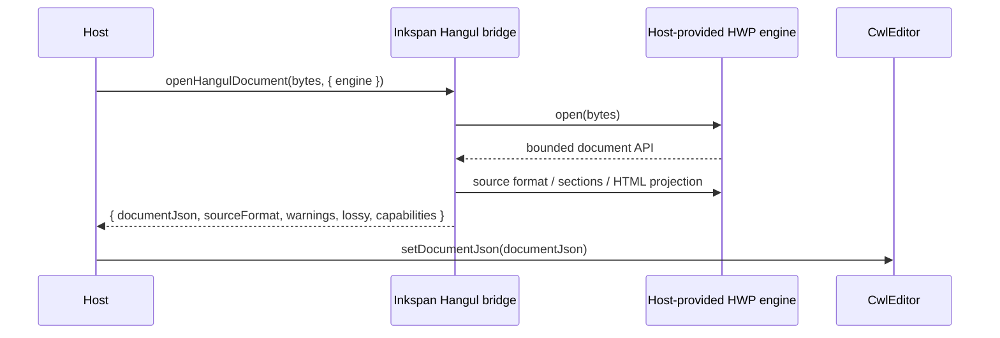
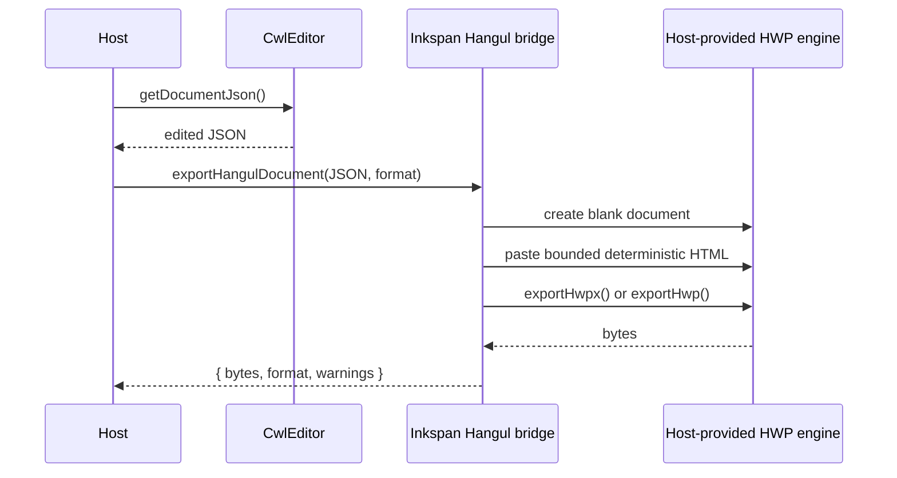

# HWP and HWPX authoring

Inkspan's Hangul bridge opens HWP/HWPX bytes through a host-provided parser/serializer and projects supported content into the same TipTap/ProseMirror JSON edited by `CwlEditor`. HWPX is the recommended save target because it is the open XML/OWPML path standardized by KS X 6101; legacy HWP remains an explicit compatibility target when the selected engine supports it.

## Authority boundary

Inkspan owns:

- the editable TipTap JSON projection;
- deterministic conversion rules;
- stable error semantics;
- byte/resource limits;
- explicit loss reporting;
- deterministic public capability metadata for the bounded bridge.

The host owns:

- file pickers and drag/drop;
- filesystem and object-storage access;
- WASM or native-engine initialization;
- passwords and protected-document UX;
- publication/download behavior;
- telemetry and persistence.

The Hangul package never fetches external resources and never executes active content from a document.

## Import flow



The original bytes remain host-owned. Importing a file does not mutate it. The returned `capabilities` object is frozen, deterministic Inkspan metadata: it declares `importFormats`, `exportFormats`, `recommendedExportFormat`, and the currently round-trippable `supportedContent`. Hosts can use that metadata for UI and routing without probing the host engine or inferring support from failures.

## Export flow



## Minimal integration

```ts
import {
  exportHangulDocument,
  openHangulDocument,
  type HangulDocumentEngine,
} from '@contextualwisdomlab/cwl-editor/hangul';

async function openIntoEditor(
  source: Uint8Array,
  engine: HangulDocumentEngine,
  editor: { setDocumentJson(value: unknown): void },
) {
  const imported = await openHangulDocument(source, { engine });
  editor.setDocumentJson(imported.documentJson);
  return imported;
}

async function saveAsHwpx(
  documentJson: Parameters<typeof exportHangulDocument>[0],
  engine: HangulDocumentEngine,
) {
  return exportHangulDocument(documentJson, {
    engine,
    format: 'hwpx',
  });
}
```

## Compatibility contract

The initial bridge deliberately supports a bounded semantic subset and rejects unsupported export nodes instead of silently deleting them. The compatibility matrix expands only when real HWP/HWPX fixtures demonstrate stable round-trip behavior. `capabilities.supportedContent` is the machine-consumable projection of the same currently implemented subset; this table remains the human-readable contract and limitation guide.

Committed synthetic OWPML fixtures under `src/hangul/fixtures/` are the current known-document suite. `briefing-minutes.section.xml` must project to the expected heading, paragraph, and table cells when wrapped as HWPX or legacy HWP. `unsupported-shape.section.xml` must fail closed; Inkspan does not keep surrounding paragraphs while dropping a shape. After export, the same fixture engine reopens the bytes and compares semantic JSON. These fixtures are synthetic and contain no customer documents. To inspect a mismatch, open the exact source fixture and compare it against the committed expected paragraphs and tables.

| Content | Import | Export | Notes |
|---|---|---|---|
| Paragraph text | Yes | Yes | Unicode preserved by JavaScript strings and the selected engine |
| Headings 1-6 | Yes | Yes | Semantic heading level |
| Bold | Yes | Yes | Common HTML projection |
| Italic | Yes | Yes | Common HTML projection |
| Strike | Yes | Yes | Common HTML projection |
| Lists | Yes | Yes | Structural bullet and ordered lists; explicit start-number metadata is not modeled |
| Block quotes | Yes | Yes | Nested supported block content is preserved |
| Code blocks | Yes | Yes | Text content is preserved; language metadata is not modeled |
| Basic tables | Yes | Yes | Header/cell topology is preserved; spans and layout styling are not modeled |
| Links | Planned | Planned | Must use Inkspan safe-link policy |
| Images | Planned | Planned | Must remain inline/host-approved; no external fetch |
| Shapes/charts/equations | Rejected | Rejected | Fail closed; no silent drop |
| Macros/OLE/active content | Not executed | Not generated | Outside the editor authority boundary |

## Failure containment

The host engine is untrusted at every call boundary, including cleanup. Open/create/operation failures are normalized to stable payload-redacted `HangulDocumentError` values. If engine cleanup fails after an otherwise successful public operation, Inkspan reports `ENGINE_CLEANUP_FAILED` without reading or stringifying the host-thrown value. If cleanup fails while Inkspan is already propagating a normalized primary import/export error, the primary error remains authoritative and the secondary cleanup failure is contained.

## Security requirements

Treat both formats as untrusted document containers. Production implementations must enforce bounded source and output bytes. The bridge also rejects host structural metadata above 4,096 sections, 1,000,000 paragraphs per section, or 16,777,216 UTF-16 code units per paragraph before traversing or passing those values back to the host engine. These are Inkspan safety ceilings, not HWP/HWPX format maxima.

A native HWPX implementation must additionally bound ZIP entry count, expanded bytes, expansion ratio, XML depth, XML node count, text size, relationships, and embedded payloads. DTD and external entity resolution must be disabled. External relationships are metadata only unless the host separately authorizes a resource.

Passwords, cookies, credentials, filesystem paths, and secret values must never enter warnings, error strings, result objects, or deterministic snapshots.

## Standards and format sources

HWPX follows OWPML document structure standardized as KS X 6101. The Korean standards catalogue records the standard as confirmed on 2024-10-30. Hancom publishes HWP 5.x and OWPML format material and recommends HWPX as the open machine-readable Hangul document format.

### References (APA 7th)

Korean Agency for Technology and Standards. (2024). *KS X 6101: Open Word-Processor Markup Language (OWPML) document structure*. e-Nara Standard Certification. https://www.standard.go.kr/KSCI/standardIntro/getStandardSearchView.do?ksNo=KSX6101

Hancom Inc. (n.d.). *HWP/OWPML formats*. https://license.hancom.com/support/downloadCenter/hwpOwpml

Hancom Inc. (n.d.). *HWPX format structure*. Hancom Tech. https://tech.hancom.com/hwpxformat/
