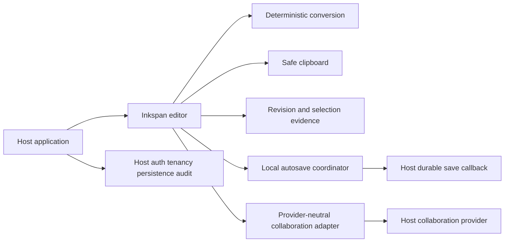
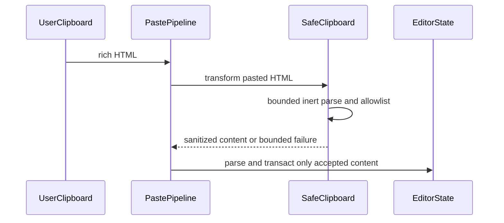
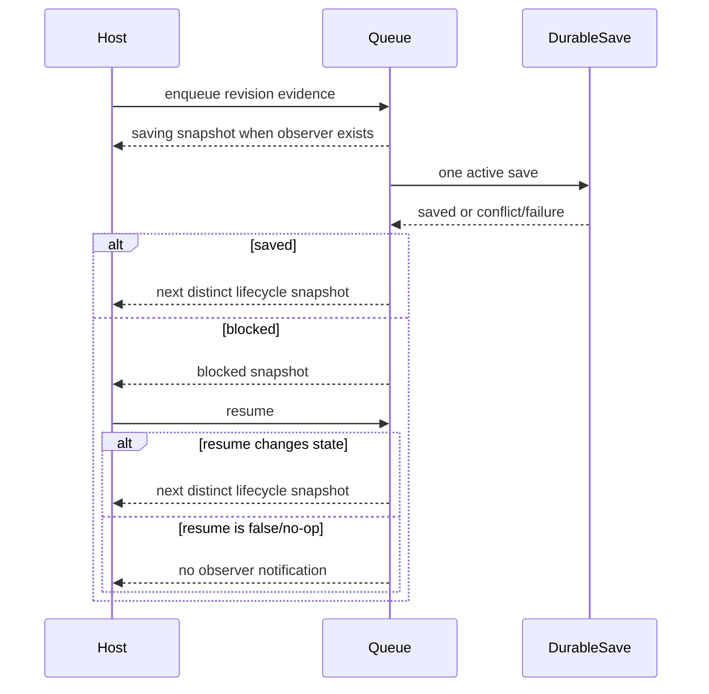
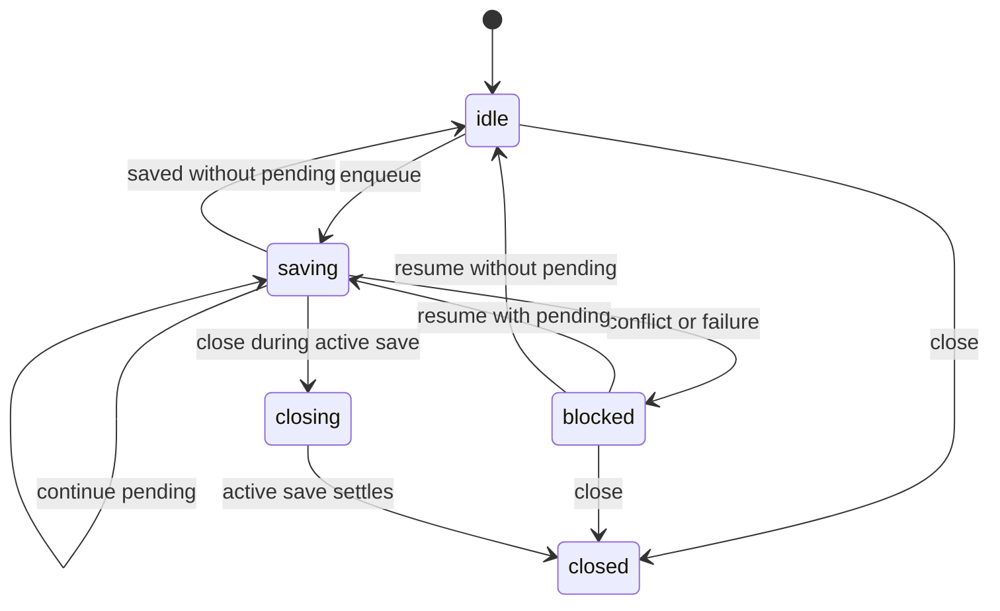
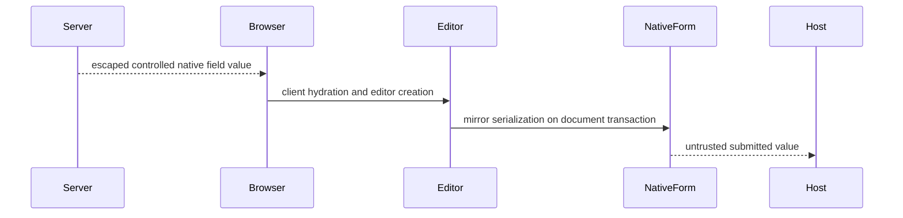
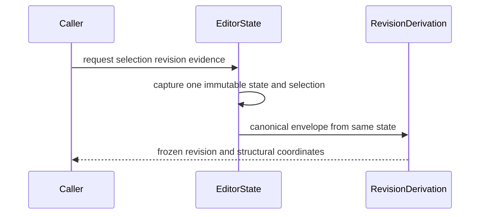
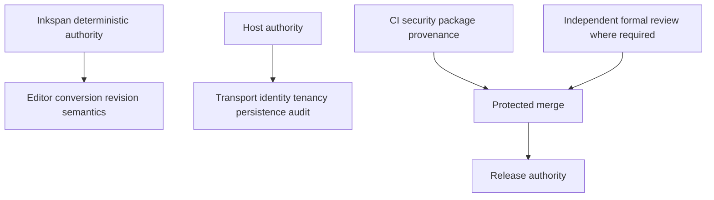

# Inkspan Runtime Diagrams

Status: Proposed canonical baseline

## Component topology

## Paste sequence

## Autosave sequence and no-op rule

## Autosave state machine

## SSR and native form sequence

## Selection and revision capture

## Authority boundaries

