# Inkspan Runtime Diagrams

Status: Protected-main canonical baseline

These diagrams describe the accepted product boundary. Protected `main` remains implementation authority; elements owned by open PRs are Proposed until integrated.

## Bounded-context and component topology

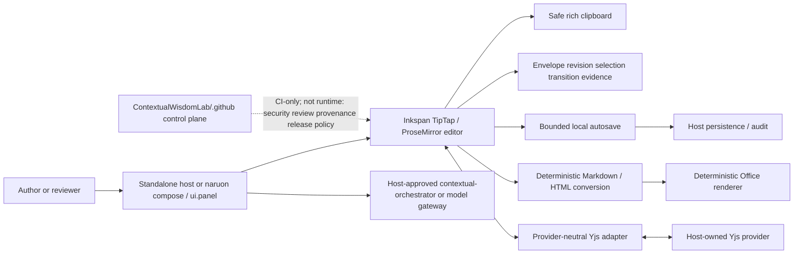

The host owns transport, authentication, authorization, tenant isolation, persistence, credentials, provider lifecycle, retention, deployment, durable audit, and model-use policy. Inkspan owns deterministic local editor/conversion/evidence behavior only.

## Rich paste sequence

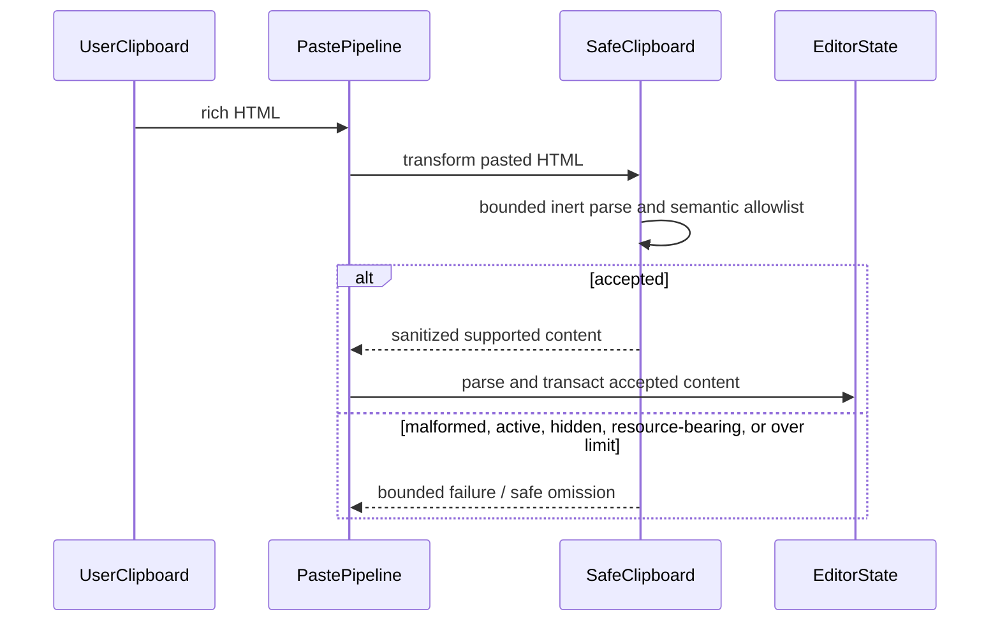

Security-relevant browser fragment semantics require the same hostile corpus under Chromium, Firefox, and WebKit before the relevant release line.

## Cross-engine browser-semantic release assurance

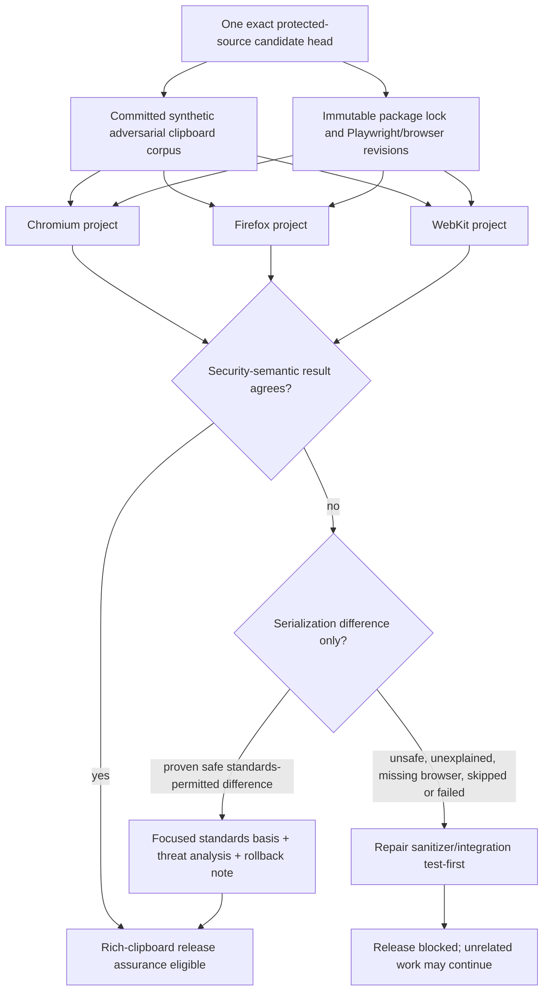

A queued, pending, skipped, cancelled, absent or failed required browser is not passing evidence. Differences are never normalized merely to make engines agree; any admitted difference is a reviewed compatibility artifact. ADR 0016 and Issue #66 own this planned release-assurance decision behind the SafeClipboard integration dependency.

## Author-to-model proposal sequence

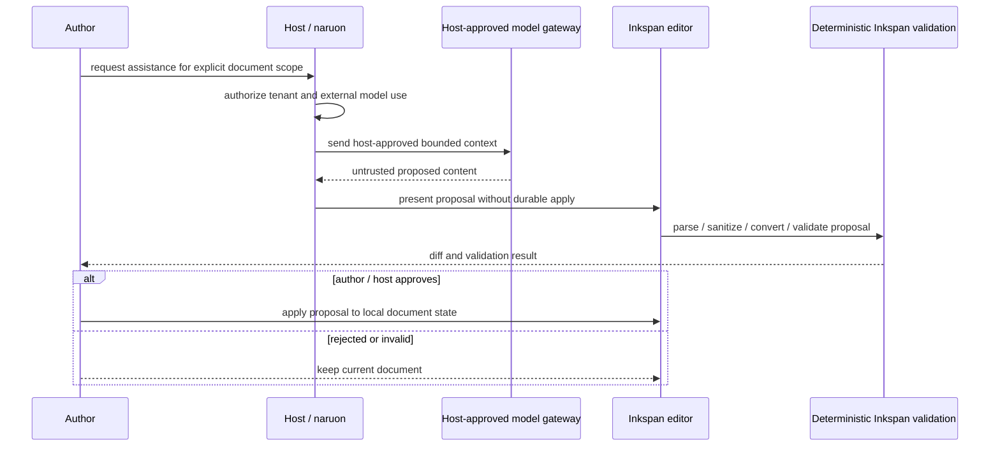

Model output never bypasses deterministic validation, host authorization, user review, or durable save concurrency.

## Import and export flow

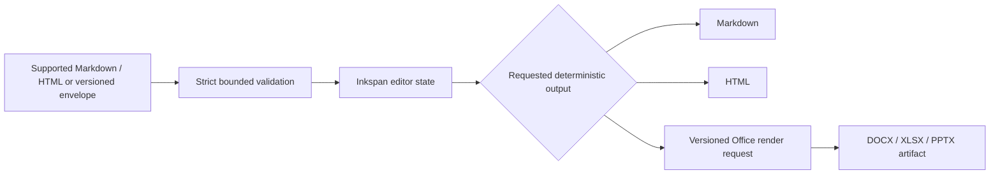

Unsupported or lossy constructs are surfaced by the relevant contract instead of being advertised as lossless round-trip fidelity.

## Envelope identity and host-owned migration routing

```mermaid
sequenceDiagram
  participant Host
  participant Inspector as Planned bounded identity inspector
  participant Registry as Host migration registry
  participant Migration as Host-owned version migration
  participant StrictParser as Current-schema strict parser
  participant Inkspan

  Host->>Inspector: complete untrusted envelope
  Inspector->>Inspector: bounded JSON/UTF-8/duplicate-name/descriptor validation
  alt identity invalid
    Inspector-->>Host: stable redacted failure
  else identity valid
    Inspector-->>Host: frozen schemaId + schemaVersion only
    Host->>Registry: select authorized migration route
    alt current supported identity
      Host->>StrictParser: validate current envelope
    else registered legacy/future route
      Registry->>Migration: run version-specific host migration
      Migration-->>Host: candidate current-schema envelope
      Host->>StrictParser: strict current-schema validation
    else no route
      Registry-->>Host: unsupported version; preserve original source
    end
    StrictParser-->>Inkspan: canonical document only after strict success
  end
```

The identity result does not contain the document body and does not prove migration, authorization, persistence or durable success. ADR 0015 and Issue #74 define this planned routing aid; the host continues to own schema registry, migration execution, persistence, audit and rollback.

## Office render and file publication sequence

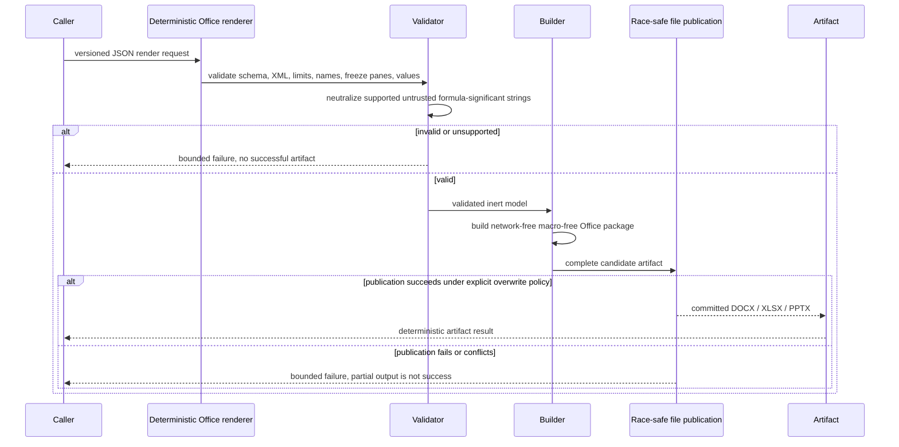

## File publication state machine

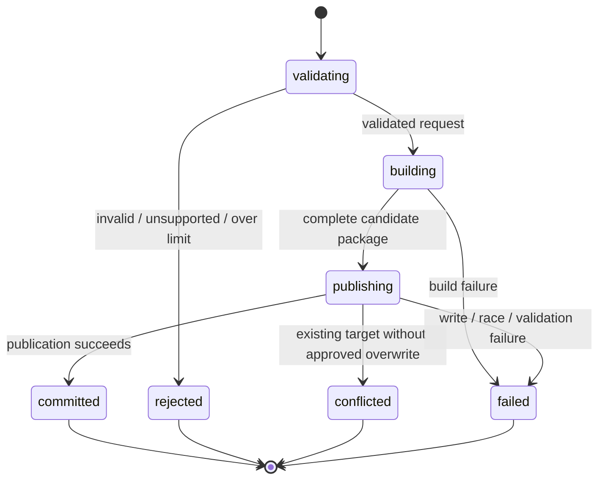

No failed or partial file publication becomes a successful conversion artifact.

## Autosave sequence and no-op observer rule

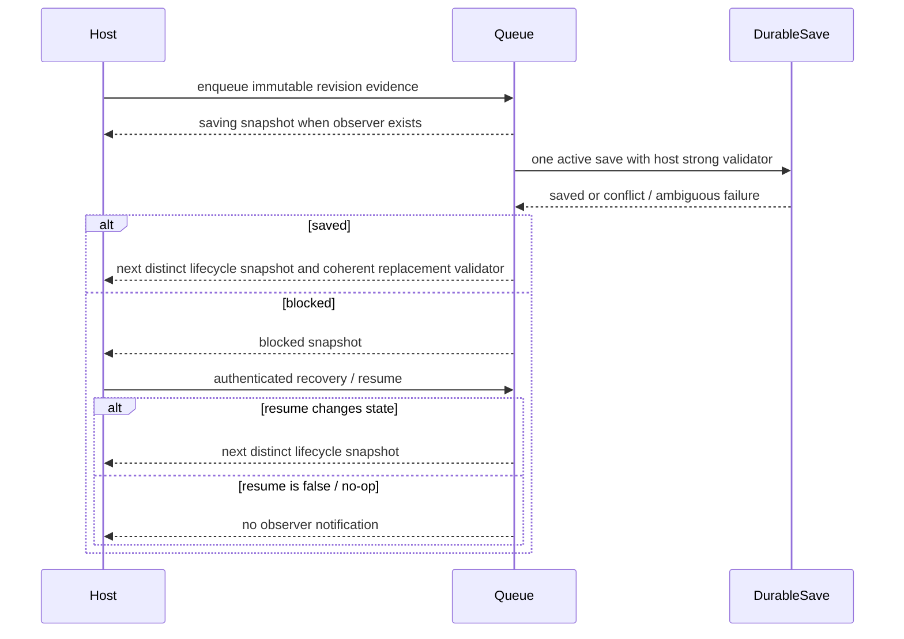

## Autosave state machine

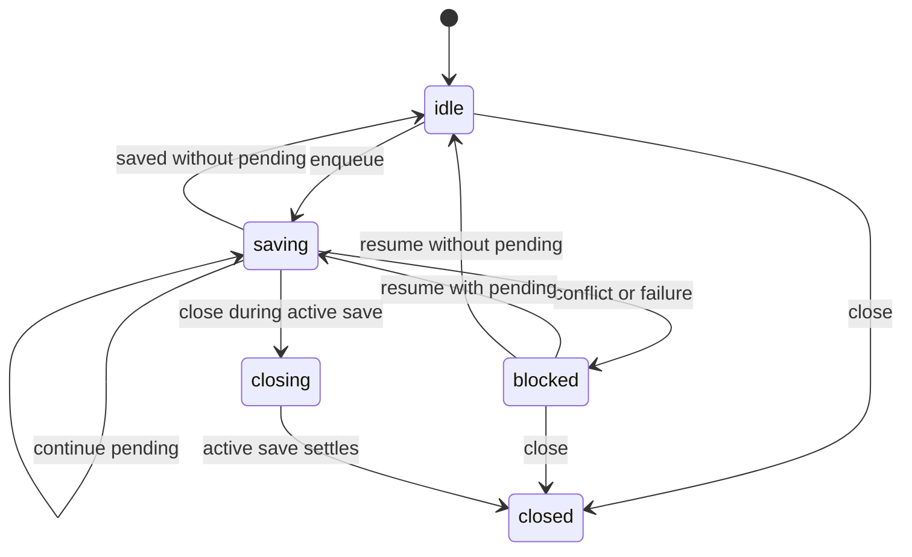

## SSR and native form sequence

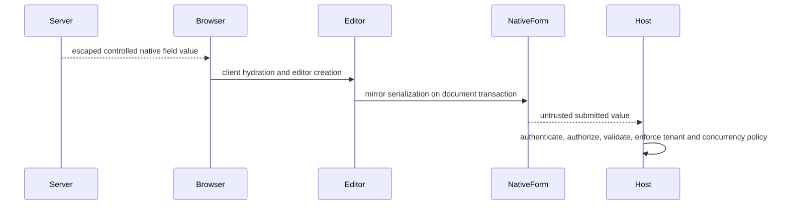

## Selection and revision capture

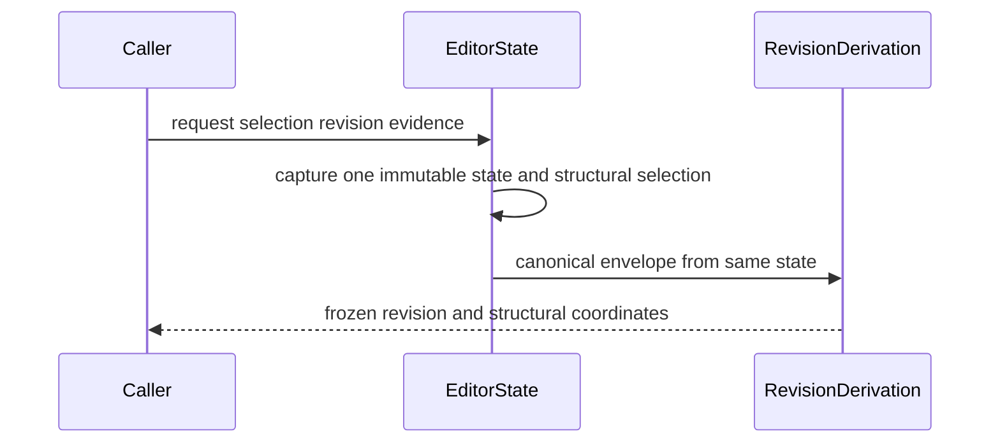

## Provider-neutral Yjs collaboration sequence

```mermaid
sequenceDiagram
  participant Host
  participant Provider as Host-owned Yjs provider
  participant YDoc as Host-supplied Yjs document
  participant Inkspan
  participant Awareness as Host-governed awareness

  Host->>Provider: authenticate / authorize room and create lifecycle
  Provider<->>YDoc: synchronize host-owned updates
  Host->>Inkspan: mount with supplied YDoc / awareness binding
  Inkspan<->>YDoc: deterministic editor binding
  Inkspan<->>Awareness: bounded awareness presentation
  Note over Inkspan,Provider: Inkspan does not own credentials, room authorization, persistence, retention, or provider destruction
  Host->>Inkspan: unmount panel / editor
  Host->>Provider: retain or destroy provider according to host lifecycle
```

## naruon modular composition

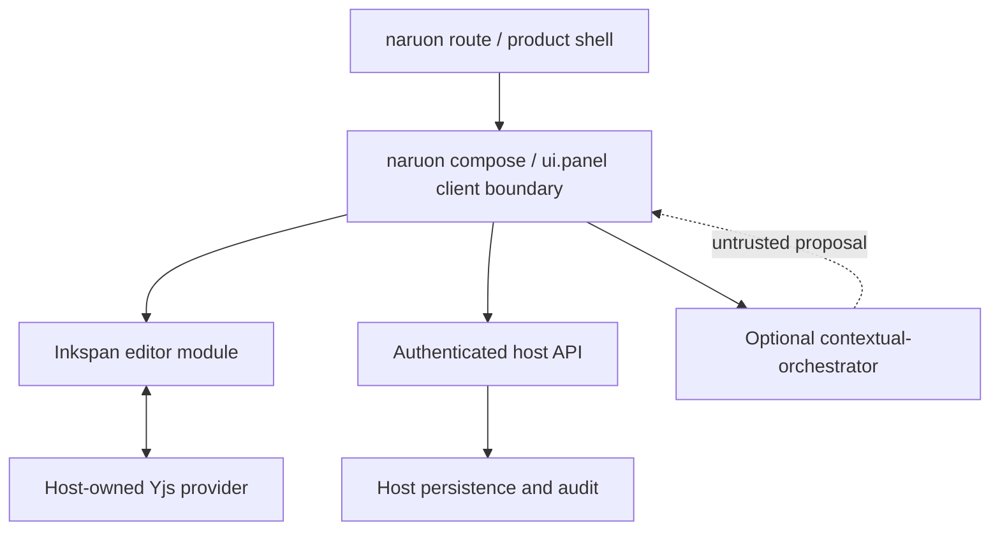

Inkspan remains importable without naruon or contextual-orchestrator.

## Deployment topology

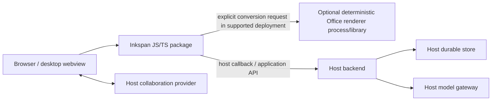

The diagram does not imply a required network service owned by Inkspan. The Office renderer may be used as an independent library/tool under its package contract.

## Failure and degraded modes

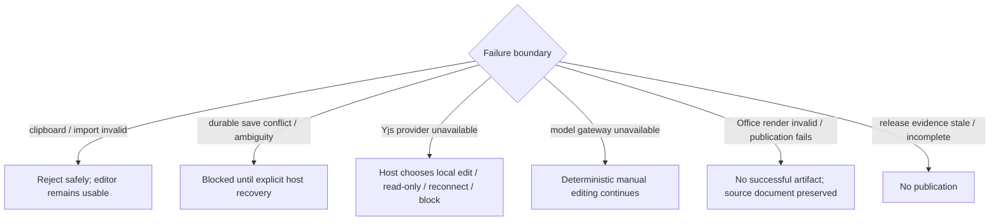

## Authority and release evidence flow

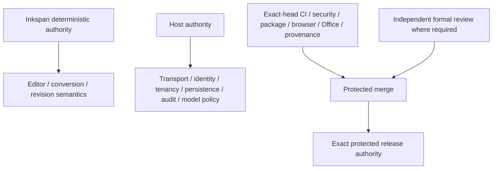
