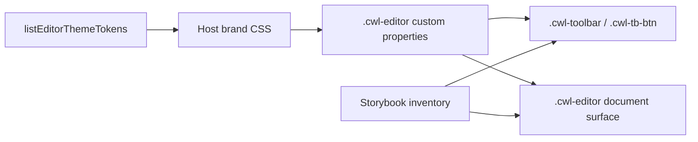

# Editor chrome design tokens

Status: Active PR / Proposed

Use this catalog when you need to re-theme Inkspan's repeating toolbar and editor chrome. Override the named custom properties on `.cwl-editor` after checking WCAG 2.2 contrast. Do not edit Inkspan internals.

```css
.cwl-editor {
  --cwl-accent: #0b6e4f;
  --cwl-accent-soft: #d8f3e8;
}
```

```ts
import {
  contrastRatioFromHex,
  getEditorThemeTokenContrast,
  listEditorThemeTokens,
  toDesignTokenFormatGroup,
} from '@contextualwisdomlab/cwl-editor';

const tokens = listEditorThemeTokens();
const dtcgGroup = toDesignTokenFormatGroup();
const contrast = getEditorThemeTokenContrast('cwl-fg', 'cwl-bg', 'light');
const overrideRatio = contrastRatioFromHex('#0b6e4f', '#ffffff');
if (contrast.ratio < 4.5 || overrideRatio < 4.5) {
  throw new Error(contrast.hostAction);
}
void tokens;
void dtcgGroup;
```

The stylesheet remains runtime presentation authority. `toDesignTokenFormatGroup()` is an interchange snapshot aligned to Design Tokens Format Module 2025.10. It is not complete DTCG conformance, Figma Variables sync, or a host WCAG certification.

Preview the repeating objects in Storybook (`pnpm storybook`) using the inventory in [`storybook-inventory.md`](storybook-inventory.md).


