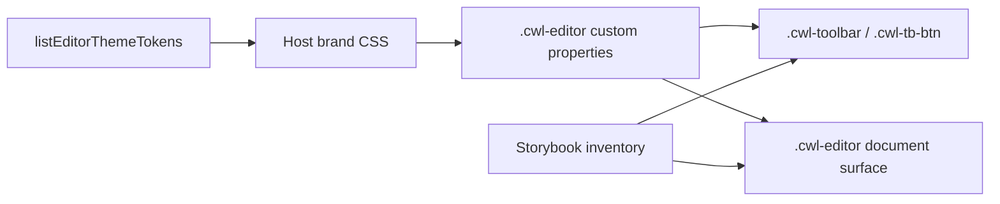

# Editor chrome design tokens

Status: Shipped protected-main truth (2026-08-25)

Use this catalog when you need to re-theme Inkspan's repeating toolbar and editor chrome. Protected-main CSS defaults are the shipped presentation baseline; the shipped dark active-toolbar pair uses `--cwl-accent: #58a6ff` on `--cwl-accent-soft: #163356` and measures about 5.06:1. When a host overrides any color token, re-check WCAG 2.2 contrast for both body text (`--cwl-fg` on `--cwl-bg`) and active toolbar text (`--cwl-accent` on `--cwl-accent-soft`). Do not edit Inkspan internals.

`getEditorThemeTokenContrast()` checks only Inkspan catalog values for the requested light/dark/print scheme; it does not read resolved host CSS. After an override, obtain the actual resolved hex colors from the host theme and call `contrastRatioFromHex(actualForegroundHex, actualBackgroundHex)` before shipping that theme.

```css
.cwl-editor {
  --cwl-accent: #0b6e4f;
  --cwl-accent-soft: #d8f3e8;
}
```

```ts
import {
  contrastRatioFromHex,
  getEditorThemeTokenContrast,
  listEditorThemeTokens,
  toDesignTokenFormatGroup,
} from '@contextualwisdomlab/cwl-editor';

const tokens = listEditorThemeTokens();
const dtcgGroup = toDesignTokenFormatGroup();
const body = getEditorThemeTokenContrast('cwl-fg', 'cwl-bg', 'light');
const activeDark = getEditorThemeTokenContrast('cwl-accent', 'cwl-accent-soft', 'dark');
const actualForegroundHex = '#0b6e4f';
const actualBackgroundHex = '#d8f3e8';
const overrideRatio = contrastRatioFromHex(actualForegroundHex, actualBackgroundHex);
if (!body.meetsTextContrast || !activeDark.meetsTextContrast || overrideRatio < 4.5) {
  throw new Error(activeDark.hostAction);
}
void tokens;
void dtcgGroup;
```

The default-theme checks above are protected-main shipped evidence, not a host WCAG certification. The stylesheet remains runtime presentation authority. `toDesignTokenFormatGroup()` is an interchange snapshot aligned to Design Tokens Format Module 2025.10; it is not complete DTCG conformance or Figma Variables sync.

Preview the repeating objects in Storybook (`pnpm storybook`) using the inventory in [`storybook-inventory.md`](storybook-inventory.md).


