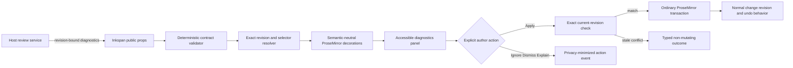

# Revision-Bound Writing Diagnostics Design

**Date:** 2026-08-12  
**Status:** Proposed design; not shipped behavior  
**Target:** Next Inkspan feature release after the current protected-main release train

## Objective

Add a provider-neutral, Grammarly-like writing-diagnostic surface without turning Inkspan into a language model, email product, policy engine, persistence service, or hidden semantic classifier.

A host application generates contextual writing proposals using its own model, rubric, authorization, privacy, retention, and review policy. Inkspan admits only structurally valid host proposals, binds them to one exact document revision and text projection, renders them accessibly, and permits explicit user actions without allowing stale asynchronous output to mutate changed content.

Host-defined categories may describe spelling, grammar, spacing, punctuation, clarity, concision, structure, tone, pragmatics, technical precision, or actionability. Inkspan treats those fields as opaque proposal data. It does not determine whether a category, explanation, confidence, priority, or replacement is semantically correct.

## Product behavior

An author sees normal Inkspan editing first. When the host supplies an admitted diagnostic set:

1. non-empty affected ranges receive non-color-only visual decorations;
2. a named diagnostics region reports the count and exposes an ordered list;
3. each item exposes category, priority, title, explanation, and optional replacement as plain text;
4. keyboard, pointer, touch, and assistive-technology users can navigate the previous or next diagnostic;
5. Focus moves to an affected structural range only after explicit user navigation;
6. Apply rechecks the exact current revision and applies one selected plain-text replacement through one ordinary ProseMirror transaction;
7. Ignore and Dismiss emit privacy-minimized host-visible actions without changing canonical content;
8. Explain reveals the supplied explanation or invokes an explicit host callback; Inkspan performs no model call;
9. asynchronous arrival never steals focus; and
10. stale diagnostics never apply through nearest-text search, keyword search, quote search, remapping, or silent position repair.

Diagnostics remain advisory. Their presence, absence, invalidity, or staleness does not block form submission, sending, export, persistence, or collaboration in the editor package.

## Selected architecture



The host may be Naruon, another CWL product, or an unrelated consumer. No host, provider, model, email, or tenant name appears in the generic runtime contract.

## Public contract

The v1 design mirrors the implementation types rather than maintaining a second approximate schema.

```ts
export type CwlWritingDiagnosticPriority =
  | 'advisory'
  | 'important'
  | 'critical';

export interface CwlWritingDiagnosticProvenance {
  readonly workflowId: string;
  readonly workflowVersion: string;
  readonly judgePolicyVersion: string;
  readonly orchestrationMode?: string;
}

export interface CwlWritingDiagnostic {
  readonly diagnosticId: string;
  readonly documentRevision: CwlEditorDocumentRevision;
  readonly textProjection: CwlEditorTextProjectionIdentity;
  readonly selector: CwlEditorTextPositionSelector;
  readonly categoryCode: string;
  readonly priority: CwlWritingDiagnosticPriority;
  readonly title: string;
  readonly explanation: string;
  readonly suggestedReplacement?: string;
  readonly confidence?: number;
  readonly provenance: Readonly<CwlWritingDiagnosticProvenance>;
}

export type CwlWritingDiagnosticAction =
  | 'applied'
  | 'ignored'
  | 'dismissed'
  | 'requested_explanation'
  | 'stale'
  | 'conflict';

export type CwlWritingDiagnosticActionReasonCode =
  | 'explicit'
  | 'document_changed'
  | 'revision_mismatch'
  | 'projection_mismatch'
  | 'selector_invalid'
  | 'verification_failed'
  | 'lifecycle_ended'
  | 'diagnostic_missing';

export interface CwlWritingDiagnosticActionEvent {
  readonly action: CwlWritingDiagnosticAction;
  readonly reasonCode: CwlWritingDiagnosticActionReasonCode;
  readonly diagnosticId: string;
  readonly documentRevision: CwlEditorDocumentRevision;
  readonly categoryCode: string;
  readonly generation: number;
}
```

Candidate additive editor props are:

```ts
interface CwlEditorProps {
  writingDiagnostics?: readonly CwlWritingDiagnostic[];
  onWritingDiagnosticAction?: (
    event: CwlWritingDiagnosticActionEvent,
  ) => void;
  onWritingDiagnosticsError?: (error: WritingDiagnosticError) => void;
  writingDiagnosticsLabel?: string;
  printWritingDiagnostics?: boolean;
}
```

Candidate imperative methods use the same controller and validation path as the built-in panel. There is no trusted imperative bypass.

## Validation boundary

The deterministic validator fails closed and verifies:

- exact own enumerable data properties and no unsupported fields, symbols, accessors, sparse arrays, inherited fields, or hostile reflection;
- bounded collection size, identifier length, category length, title, explanation, replacement, and provenance identifiers;
- unique diagnostic identifiers within one submitted generation;
- supported finite priority and confidence values;
- an exact lowercase SHA-256 revision object and matching strong entity tag;
- the exact `inkspan-prosemirror-text` version 1 projection identity;
- selector values are non-negative safe integers with start <= end;
- Unicode-code-point and grapheme-cluster boundaries;
- one unambiguous structural range in the exact projected snapshot; and
- plain-text replacement values only.

Collapsed selectors are valid evidence and remain navigable, but they create no inline range decoration. Empty and non-empty selectors use the same exact revision/projection admission path.

The validator does not decide whether an explanation is true, a replacement is better, a message is polite, or a category label is accurate. Regexes may validate bounded identifiers and revision syntax, but they cannot create, prioritize, admit, or semantically classify a diagnostic.

## Revision and position lifecycle

### Initial admission

The host reviews one immutable document snapshot and returns diagnostics carrying that snapshot's exact `CwlEditorDocumentRevision`, projection identity, and W3C text-position selector. Inkspan validates the complete untrusted set before reading editor state, derives one current revision from one immutable editor snapshot, resolves all selectors against that same snapshot, and publishes only a complete verified generation.

### Strict invalidation

Every local or collaborative transaction with docChanged === true invalidates the complete active diagnostic generation.

Version 1 does not preserve, map, remap, repair, or re-admit a diagnostic after changed document content. ProseMirror mapping and Yjs relative positions are useful editor mechanisms, but neither proves that a host model judgment remains semantically current. A stale async digest or selector result is discarded through the generation fence. The host must submit a new set bound to the new exact revision.

### Explicit action

Version 1 applies exactly one explicitly selected diagnostic at a time.

Immediately before application, Inkspan derives and compares the current exact revision again. A matching diagnostic with a valid plain-text replacement produces one ordinary ProseMirror transaction and normal undo history. A mismatch, missing diagnostic, invalid selector, ended lifecycle, or changed document returns a typed non-mutating event. Successful application invalidates every remaining diagnostic and derives the resulting revision from the post-transaction document.

There is no Apply All or batch mutation authority in v1. Overlapping diagnostics may be displayed independently, but each action is revalidated after every document change.

### Re-review

The host may use a stale/conflict action event to request a new review. Inkspan performs no network call, retry, provider fallback, or diagnostic regeneration.

## Decoration and accessibility model

Inline decorations contain only:

```text
class="cwl-writing-diagnostic cwl-writing-diagnostic--{priority}"
data-cwl-diagnostic-id="opaque-id"
```

Inkspan does not derive aria-invalid or any other semantic accessibility state from opaque host strings.

The editor does not infer spelling, grammar, mechanics, tone, or correctness from `categoryCode`, title, explanation, replacement, confidence, provenance, or source text. It does not place those strings in decoration attributes. The named diagnostics panel is the semantic accessibility surface.

The panel must provide:

- a named region and count summary;
- an ordered list with category, priority, title, and explanation;
- explicit previous/next navigation with roving focus;
- an affected-range Focus action;
- Apply, Ignore, Dismiss, and Explain native buttons;
- a disabled Apply action when no replacement exists;
- a polite status region for ordinary completed actions;
- an assertive alert only for an actual application conflict;
- no focus theft when diagnostics arrive asynchronously; and
- equivalent information without color, hover, pointer input, animation, or generated CSS content.

Host strings render as React text nodes only. Action names may use the diagnostic title but never copy selected source text into DOM attributes. Underlines are a visual supplement, not the sole information channel.

## Host feedback surface

Default action events contain only opaque identifiers, exact revision evidence, opaque category code, generation, action, and bounded reason code. They contain no selected source text, replacement text, explanation, prompt, raw model output, email recipient, credential, document envelope, or tenant identifier.

A host requiring richer audit evidence reads it from its own authorized review-session store. Generic analytics must not become a shadow copy of authored content.

## Security and privacy

- Treat every diagnostic object and host string as untrusted input.
- Reject accessors, prototypes, symbols, extra fields, sparse arrays, proxies, duplicate identifiers, and resource-limit violations.
- Render title, explanation, category, and replacement previews as text, never trusted HTML.
- Accept only plain-text replacement values in v1.
- Do not allow commands, JavaScript, arbitrary TipTap JSON, host callbacks, or executable markup inside a diagnostic.
- Do not place authored or model-produced text in logs, exceptions, analytics, performance marks, awareness payloads, or decoration attributes.
- Do not expose provider credentials, raw provider traces, or tenant data through provenance.
- Preserve Inkspan's no-runtime-environment-read and no-network-call contracts.

## Semantic keyword prohibition

Inkspan must produce zero diagnostics unless the host explicitly supplies them. It contains no semantic rule based on keywords, regexes, phrase dictionaries, sender domains, recipient counts, language names, positions, or nearest-text similarity. Opaque values that happen to contain words such as `spelling`, `grammar`, `mechanics`, `rude`, `incorrect`, or multilingual equivalents do not gain behavior or semantic ARIA authority.

## Failure behavior

| Condition | Inkspan behavior |
|---|---|
| No diagnostics supplied | Normal editor behavior |
| Host review pending or unavailable | Normal editor; optional host-owned status UI |
| Malformed or oversized input | Reject complete set through a redacted typed error; no editor mutation |
| Revision mismatch | Do not install or apply; return bounded stale/conflict evidence |
| Unsupported projection | Reject; no nearest-text or compatibility recovery |
| Invalid or ambiguous selector | Reject complete set; no guessed position |
| Local or remote document change | Invalidate complete active generation immediately |
| Host callback throws | Contain callback failure; preserve deterministic editor state |
| Editor destroyed | Return typed non-mutating lifecycle evidence |

## Testing strategy

### Contract and hostile-input tests

- exact fields, types, limits, priorities, confidence, revision, projection, and selector validation;
- duplicate identifiers, sparse arrays, accessors, inherited fields, symbols, proxies, and hostile reflection;
- Unicode astral characters, Korean/CJK, combining marks, emoji, bidirectional text, empty/collapsed selectors, and grapheme boundaries;
- immutable detached public values and redacted errors.

### Editor and concurrency tests

- exact decoration attributes and no semantic ARIA derivation;
- local and remote `docChanged` invalidation;
- generation fencing for overlapping async verification;
- exact application recheck, ordinary transaction, resulting revision, and one-step undo;
- no mutation on rejected or stale input;
- privacy-minimized action events and callback-failure containment;
- zero diagnostics without host input.

### Accessibility tests

- named region, ordered list, count, category, priority, title, and explanation;
- keyboard navigation, roving focus, and explicit actions;
- no focus theft, polite status, conflict alert, forced colors, high contrast, reduced motion, print, zoom, and touch targets;
- no visual-only or hover-only information.

### Collaboration, package, and browser tests

- standalone/collaborative API parity and remote invalidation;
- no diagnostics in Yjs awareness payloads;
- SSR-safe shell and deterministic hydration;
- packed ESM/CommonJS/strict-TypeScript consumers;
- React-free `writing-diagnostics` subpath;
- Chromium, Firefox, and WebKit evidence; and
- exact 100% owned production statement, branch, function, and line coverage plus complete public JSDoc.

## Performance constraints

- Validation is linear in bounded diagnostic count and bounded projection size.
- At most 256 active diagnostics are admitted by default.
- One immutable snapshot and one revision derivation are shared across one verification generation.
- No document clone or digest is repeated merely to render an already admitted set.
- A document change invalidates rather than remaps the set, keeping v1 lifecycle cost deterministic.
- Telemetry records counts and timing buckets, not authored text.

## Documentation and release requirements

Implementation must synchronize root README, public API/JSDoc, PRD, TRD, API contract, architecture, threat model, operability, selector/revision guides, collaboration guide, test strategy, ADR index, traceability, CHANGELOG, package consumers, SBOM/provenance, rollback, and release evidence.

The feature remains `Unreleased`. It may ship only after the complete stack is reconciled onto protected main, temporary branch-specific workflows are removed, exact-head CI/security/coverage/package/browser evidence succeeds, zero valid findings remain, qualifying independent review exists, and a separate release-only PR publishes immutable artifacts.

## Out of scope

- model invocation, model selection, prompt construction, rubric ownership, judge calibration, or provider failover;
- spelling dictionaries or deterministic grammar/tone classifiers;
- email/thread/recipient semantics;
- host submission, send, persistence, or compliance gates;
- persistent review sessions and cross-user aggregation;
- human-review assignment; and
- provider billing, retention, or training.

## Primary references

- W3C Web Annotation Data Model for Unicode-code-point `TextPositionSelector` semantics and its warning that positions are brittle across resource changes.
- TipTap v2 and ProseMirror documentation for immutable editor state, transactions, selections, and decorations.
- RFC 9110 for strong entity-tag semantics used by Inkspan revision evidence.
- Inkspan ADR 0011 for deterministic versus model-assisted authoring.
- Inkspan ADR 0018 for revision-scoped W3C selector authority.
- Inkspan ADR 0028 and ADR 0029 for host semantic authority, strict invalidation, and semantic-neutral accessibility.
- The accompanying doctoring record for LLM-judge bias and host calibration implications.

## Approval boundary

Approval of this design authorizes implementation work, not production claims. The feature remains unshipped until protected main contains the reconciled implementation, canonical documentation, exact acceptance evidence, independent approval, and verified release artifacts.
