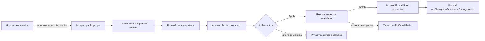

# Revision-Bound LLM Writing Diagnostics Design

**Date:** 2026-08-12  
**Status:** Proposed design; not shipped behavior  
**Target:** Next Inkspan feature release after the current protected-main release train

## Objective

Add a provider-neutral, Grammarly-like writing-diagnostic surface to Inkspan without turning Inkspan into a language model, email product, policy engine, or persistence service.

A host application will generate contextual writing proposals using an LLM and its own review policy. Inkspan will display those proposals against the exact document revision from which they were generated, let the author inspect and apply or ignore each one, and prevent stale asynchronous output from mutating newer content.

The feature must support spelling, grammar, spacing, punctuation, clarity, concision, structure, tone, pragmatics, technical precision, and actionability as host-defined categories. Inkspan does not determine any of those categories. It exposes a generic review contract and deterministic document integrity.

## Product behavior

An author sees normal Inkspan editing first. When the host supplies diagnostics:

1. affected ranges receive non-color-only decorations;
2. the diagnostics summary reports the number and categories of suggestions;
3. keyboard and pointer users can move to the previous or next suggestion;
4. a suggestion card explains the issue and shows an optional replacement;
5. Apply changes only the selected range;
6. Ignore reports a host-visible feedback action without changing the document;
7. Dismiss removes the local presentation until the host changes the diagnostic set;
8. Explain requests no model call from Inkspan; it reveals the explanation already supplied by the host or invokes a host callback;
9. any document change revalidates or invalidates affected diagnostics;
10. stale diagnostics never apply by nearest-text search, keyword search, or silent position repair.

Diagnostics remain advisory. Their presence does not block form submission, email sending, export, or persistence in the editor package.

## Selected architecture



The host may be Naruon, another CWL product, or an unrelated consumer. No host name appears in the runtime API.

## Public contract

The exact implementation names may be refined during planning, but the semantic contract is fixed.

```ts
export type CwlWritingDiagnosticPriority = 'suggestion' | 'important';

export interface CwlWritingDiagnosticSelector {
  readonly type: 'TextPositionSelector';
  readonly start: number;
  readonly end: number;
}

export interface CwlWritingDiagnosticProvenance {
  readonly workflowId: string;
  readonly workflowVersion: string;
  readonly policyVersion: string;
  readonly providerName?: string;
  readonly modelName?: string;
}

export interface CwlWritingDiagnostic {
  readonly diagnosticId: string;
  readonly documentRevision: string;
  readonly projectionName: 'inkspan-prosemirror-text';
  readonly projectionVersion: 1;
  readonly selector: CwlWritingDiagnosticSelector;
  readonly categoryCode: string;
  readonly priority: CwlWritingDiagnosticPriority;
  readonly title: string;
  readonly explanation: string;
  readonly suggestedReplacement?: string;
  readonly confidence?: number;
  readonly provenance: CwlWritingDiagnosticProvenance;
}

export type CwlWritingDiagnosticAction =
  | 'apply'
  | 'ignore'
  | 'dismiss'
  | 'explain';

export interface CwlWritingDiagnosticActionEvent {
  readonly diagnosticId: string;
  readonly action: CwlWritingDiagnosticAction;
  readonly status: 'completed' | 'stale' | 'conflict' | 'rejected';
  readonly currentRevision?: string;
  readonly reasonCode?: string;
}
```

Candidate props:

```ts
interface CwlEditorProps {
  writingDiagnostics?: readonly CwlWritingDiagnostic[];
  onWritingDiagnosticAction?: (
    event: CwlWritingDiagnosticActionEvent,
  ) => void;
}
```

Candidate imperative method for hosts that render their own panel:

```ts
interface CwlEditorHandle {
  applyWritingDiagnosticIfMatch(
    diagnosticId: string,
  ): Promise<CwlWritingDiagnosticActionEvent>;
}
```

The component and imperative paths must call the same implementation. There cannot be a “trusted imperative” bypass.

## Validation boundary

The diagnostic validator is deterministic and fail-closed. It verifies:

- the collection is an array within a documented maximum count;
- every object contains exactly the supported fields;
- identifiers and category codes satisfy bounded syntax contracts;
- identifiers are unique within the supplied collection;
- text fields are non-empty where required and within documented limits;
- confidence, if present, is finite and in `[0, 1]`;
- the projection name and version are supported;
- the declared revision has valid Inkspan strong-entity-tag syntax;
- selector values are non-negative integers with `start < end`;
- selector boundaries are valid Unicode-code-point and grapheme-cluster boundaries;
- the range exists in the declared projection;
- replacement content passes the existing editor input, link, image, and schema policies;
- diagnostics do not contain executable markup or hidden event handlers;
- a bounded batch application contains no overlapping edits.

The validator does not decide whether an explanation is true, whether a replacement is grammatically better, or whether a message is polite. Regexes may validate identifiers and revision syntax but cannot create or admit a semantic diagnostic based on source wording.

## Revision and position lifecycle

### Initial admission

The host captures one document revision and text projection, sends that material through its review system, and returns diagnostics carrying the same revision and projection identity. Inkspan compares those fields with the editor state before rendering the proposals as current.

### Local edits

ProseMirror can map a range through transactions. Inkspan may keep a diagnostic current only when all of the following hold:

- the original revision was admitted;
- every intervening transaction exposes a valid mapping;
- the mapped range is not deleted, split ambiguously, or replaced by unrelated content;
- the host's declared policy allows mapped presentation;
- application still performs a fresh current-state check.

A mapped decoration is presentation convenience, not permission to apply stale model output. The final replacement action verifies the active state under the implementation plan's exact conflict contract.

### Remote collaborative edits

Yjs collaboration can remap local ProseMirror positions, but a model proposal remains bound to the original strong revision. A remote edit that changes the reviewed content invalidates the proposal for application. Inkspan must not treat a Yjs relative position as proof that the semantic target remained unchanged.

### Re-review

The host receives stale/conflict callbacks and may request a new review. Inkspan itself performs no network call and has no retry loop.

## Decoration and interaction model

- Different categories may use distinct underline patterns, but color alone is insufficient.
- Hover may show a preview, but every operation must be keyboard reachable.
- The editor toolbar remains one composite tab stop; diagnostic navigation may be a separate named toolbar or panel with a documented roving-tabindex pattern.
- Opening a diagnostic card does not move the caret unless the author explicitly chooses to navigate to the affected range.
- Applying a replacement creates one normal ProseMirror transaction and one normal undo step.
- After Apply, focus returns predictably to the editor at the end of the inserted replacement unless the host chooses a documented alternative.
- New asynchronous diagnostics must not steal focus or close a card the author is actively reading.
- Screen-reader output identifies category, ordinal position, affected range context, and available actions without reading the entire document.

## Host feedback surface

Inkspan reports action metadata only. The default event contains no selected source text, replacement text, explanation, prompt, raw model output, email recipient, or tenant identifier.

A host that needs richer audit evidence must deliberately read it from its own authorized review-session store. This prevents generic analytics from becoming a shadow copy of authored documents.

Recommended action reason codes include:

```text
revision_mismatch
projection_mismatch
range_deleted
range_ambiguous
replacement_rejected
batch_overlap
unsupported_diagnostic
editor_destroyed
```

Reason codes are stable machine data. Human-readable failure messages remain localized host/editor UI text.

## Security and privacy

- Treat every diagnostic field as attacker-controlled input.
- Render title and explanation as text, not trusted HTML.
- Route replacements through existing safe-link, safe-image, clipboard, and schema policy.
- Do not allow a diagnostic to carry commands, JavaScript, arbitrary TipTap JSON, or host callbacks.
- Do not place source or replacement text in logs, exceptions, analytics, or performance marks.
- Do not expose provider credentials or full provider traces through provenance.
- Bound diagnostic count, text lengths, selector sizes, and decoration work to prevent rendering denial of service.
- Reject duplicate identifiers and unsupported fields rather than accepting ambiguous objects.
- Preserve Inkspan's no-runtime-environment-read and no-network-call contracts.

## Keyword-judgment prohibition

Inkspan must contain no semantic rule such as:

```text
if text includes "무슨 말씀이신가요" then category = "tone"
if text includes "당황스럽습니다" then priority = "important"
if sender domain ends with X then apply business-language rule Y
```

Test fixtures will include:

- the same phrase quoted neutrally and used as a direct rebuke;
- the same pragmatic problem expressed with unrelated vocabulary;
- intentionally misspelled words inside code, quotations, and proper names;
- recipient metadata that changes the host's interpretation while the draft text remains identical.

Inkspan must produce zero diagnostics in every fixture unless the host explicitly supplies them. This proves the package is a renderer and integrity boundary, not a hidden classifier.

## Failure behavior

| Condition | Inkspan behavior |
|---|---|
| No diagnostics supplied | Normal editor behavior |
| Host review pending | Normal editor; optional host-owned loading UI |
| Host review failed | Normal editor; no fabricated fallback |
| Malformed diagnostic | Reject diagnostic collection or invalid entry according to the typed contract; no mutation |
| Stale revision | Mark invalid/stale; Apply unavailable; emit callback |
| Unsupported projection | Reject; no nearest-text recovery |
| Hostile explanation/replacement | Render safely or reject under existing policy |
| Overlapping batch | Reject batch; allow individually revalidated actions |
| Editor destroyed | Return typed non-mutating result |

## Testing strategy

### Pure contract tests

- exact field, type, length, and count validation;
- duplicate IDs and unexpected fields;
- finite confidence and revision syntax;
- Unicode code-point ranges and grapheme boundaries;
- immutable/frozen public event snapshots where applicable;
- overlap detection and deterministic ordering.

### Editor tests

- decorations on exact ranges;
- local transaction mapping and invalidation;
- stale application rejection;
- safe replacement and one-step undo;
- no mutation on rejected input;
- action callback content minimization;
- no diagnostic generation from source text.

### Accessibility tests

- keyboard navigation and all actions;
- named regions and controls;
- focus restoration;
- polite live status;
- non-color-only rendering;
- arrival of new diagnostics while focus remains stable.

### Collaborative tests

- local and remote edits;
- Yjs remapping followed by revision rejection;
- no awareness publication caused by diagnostics;
- standalone/collaborative public API parity.

### Package and browser tests

- packed ESM/CommonJS/type consumers;
- React 18 and 19 host builds;
- SSR/hydration;
- Chromium, Firefox, and WebKit behavior;
- production statement, branch, function, and line coverage at exactly 100%;
- public declarations and JSDoc completeness.

## Performance constraints

- Validation is linear in diagnostic count plus bounded text projection work.
- Decoration updates are incremental where ProseMirror supports it.
- A configurable hard maximum prevents unbounded diagnostic decorations.
- No source document clone or SHA-256 digest is repeated merely to render an already-admitted set.
- Applying one proposal does not serialize the full document more times than required by the existing revision guard.
- Performance telemetry records counts and timing buckets, not authored text.

## Documentation updates required with implementation

- root README and React editor examples;
- public API declarations and JSDoc;
- selection lifecycle and revision evidence guides;
- accessibility guide;
- collaboration guide;
- security/privacy guidance;
- package distribution and packed-consumer verification;
- ADR index and documentation-fitness traceability;
- CHANGELOG and release evidence.

## Out of scope

- model invocation or model selection;
- spelling dictionaries or grammar models;
- email/thread/recipient semantics;
- host policy or submission blocking;
- persistent review sessions;
- diagnostic aggregation across users;
- human-review assignment;
- provider billing and retention;
- training or calibrating an LLM judge.

Those responsibilities belong to the host or separate CWL services.

## Primary references

- W3C Web Annotation Data Model Recommendation for Unicode-code-point `TextPositionSelector` semantics and its warning that positions are brittle across resource changes.
- TipTap v2 and ProseMirror documentation for immutable editor state, transactions, selections, decorations, and mapping.
- RFC 9110 for strong entity-tag and conditional-write semantics used by Inkspan's revision boundary.
- Inkspan ADR 0011 for the deterministic versus model-assisted authoring boundary.
- Inkspan ADR 0018 for revision-scoped W3C selector authority.
- The accompanying doctoring record for LLM-judge bias and host calibration implications.

## Approval boundary

Approval of this design authorizes an implementation plan, not production claims. The feature remains unshipped until protected `main` contains the implementation, documentation, exact 100% coverage evidence, packed-package verification, cross-engine evidence, security checks, review approval, and release reconciliation.