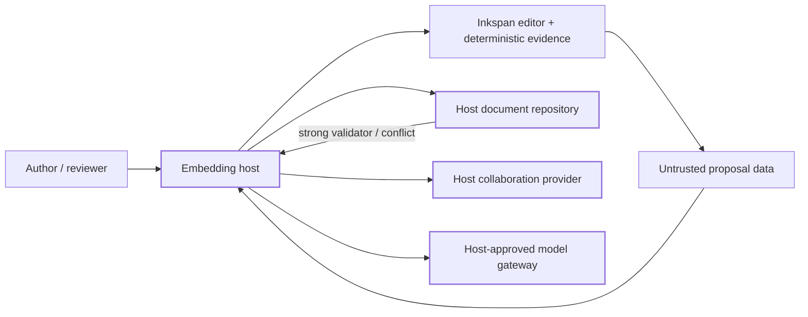

# Inkspan reference host

Status: Active PR / partial reference-host implementation

This directory is buyer-facing integration evidence for issue #377. It is intentionally **host code**, not a new Inkspan runtime surface. Protected `main` remains the shipped product authority, and this example is not production-ready until its remaining SSR/package/collaboration/accessibility/Office acceptance work is implemented and the release boundary permits integration.

The current slice contains two executable, deterministic fixtures:

- `synthetic-document-repository.mjs` demonstrates host-owned strong-validator / `If-Match` persistence behavior. Ambiguous and failed writes do not mutate durable state or advance the validator; a stale validator returns a conflict.
- `delayed-proposal.mjs` demonstrates a provider-free delayed proposal captured against one expected revision. If the current revision changes before application, the proposal returns a conflict instead of overwriting newer content.

Both fixtures are marked `REFERENCE_ONLY`, require no service, database, credential, provider SDK, or network connection, and are exercised by repository tests. They are deliberately outside the package `files` inventory so example host logic cannot silently become published Inkspan runtime authority.

## Copy this, replace that

| Reference element | Buyer action |
| --- | --- |
| synthetic document repository | Replace with an authorized atomic durable store that enforces the host's RFC 9110 `If-Match` policy and returns a new strong validator only after confirmed success. |
| deterministic delayed proposal | Replace proposal generation with a host-approved model gateway and data-use policy while preserving exact-revision conflict checks before applying untrusted proposal data. |
| synthetic document and revision identifiers | Replace with authenticated/authorized host context; never infer tenant or actor authority from an Inkspan digest, form value, or example identifier. |
| reference error handling | Map stable machine outcomes to localized host UX and audited host operations without copying document bodies, prompts, credentials, or private causes into generic telemetry. |

## Ownership map



Inkspan owns deterministic editor/revision/autosave/conversion/package behavior. The host owns authenticated transport, authorization, tenancy, durable persistence, collaboration-provider lifecycle, credentials, model policy, retention, deployment, and durable audit. A successful local editor operation, Yjs update, model response, or status check is not durable authorization or persistence evidence.

## Executable fixture checks

From a clean repository checkout with the supported Node runtime, these reference-only fixtures can be exercised directly:

```sh
node examples/reference-host/synthetic-document-repository.mjs --self-test
node examples/reference-host/delayed-proposal.mjs --self-test
```

The root test suite independently invokes those commands and asserts the expected conflict/no-silent-advancement behavior. These commands do **not** yet satisfy #377's complete packed-tarball application acceptance.

## Deliberate omissions in this partial slice

Still required before #377 can close: a packed-artifact application (preferably a supported Next.js App Router host), deterministic SSR/hydration proof, native form journeys, Inkspan autosave-state UI composition, host-created Yjs lifecycle/reconnect evidence, package CSS and both font options, real Chromium/Firefox/WebKit acceptance, read-only and forced-colors/print/narrow-viewport journeys, converter/Office handoff, and one documented clean-checkout command that builds the tarball before installing it into the example.

Do not use the synthetic repository, synthetic identifiers, or deterministic proposal fixture as a production persistence, authentication, collaboration, or model implementation.
