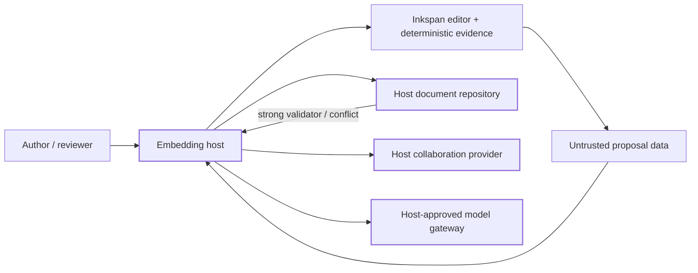

# Inkspan reference host

Status: Active PR / partial reference-host implementation

This directory is buyer-facing integration evidence for issue #377. It is intentionally **host code**, not a new Inkspan runtime surface. Protected `main` remains the shipped product authority, and this example is not production-ready until its remaining complete browser-host/collaboration/accessibility/Office acceptance work is implemented and the release boundary permits integration.

The current slice contains deterministic host fixtures and helpers, public-package presentation entrypoints, a buyer-facing native-form component, an SSR/hydration gate, and an exact-packed-artifact verifier:

- `synthetic-document-repository.mjs` demonstrates host-owned strong-validator / `If-Match` persistence behavior. `ambiguous_failure` models a pre-commit failure, while `ambiguous_commit_failure` commits durable state but returns the same ambiguous error without a replacement validator. After either ambiguous outcome, re-read durable state before retrying instead of advancing or blindly reusing the caller's last known validator. A stale validator returns a conflict. A confirmed failure can be retried with the unchanged current validator. A restore is a normal confirmed save against the current validator and advances it only after success. A fork requires the current validator, copies the current document into an independent reference repository, and starts that fork at a fresh validator.
- `delayed-proposal.mjs` demonstrates a provider-free delayed proposal captured against one expected revision. If the current revision changes before application, the proposal returns a conflict instead of overwriting newer content. Host apply callback failures are normalized to a stable payload-free error rather than reflecting private causes through the proposal boundary.
- `autosave-view-model.mjs` projects Inkspan autosave lifecycle snapshots into host-localizable `clean`, `saving`, `queued`, `conflict`, `failed`, `retrying`, `recovered`, `closing`, and `closed` presentation states. Recovery presentation is derived from observed blocked → saving → idle transitions, and validators are never returned as UI data.
- `collaboration-provider-lifecycle.mjs` demonstrates that the embedding host creates one real `Y.Doc`, reuses that same document across provider reconnects, owns provider/document teardown, and replaces a provider whose `connect()` threw rather than retrying an indeterminate resource. The deterministic provider fixture has no provider SDK or network transport and does not treat room or actor identifiers as authorization evidence.
- `single-flight-submission.ts` provides the synchronous host-local admission guard used by the form example so same-turn submit/reset races cannot invoke the durable host callback twice.
- `hydration-gate.tsx` demonstrates an application-facing client hydration gate around the public Inkspan editor contract. It is deterministic boundary evidence, not a complete framework application or browser acceptance journey.
- `reference-host-app.tsx` composes the deterministic application shell, hydration gate, and native-form host while preserving host authority; it is source-contract evidence rather than complete framework/browser acceptance.
- `browser-host.tsx` hydrates the deterministic `browser-host.html` shell into `ReferenceHostApp` for repository-built Chromium/Firefox/WebKit execution and records only host-local test submissions. It remains test-host evidence, not authorized durable persistence or exact packed-artifact acceptance.
- `presentation-full.css` imports Inkspan's public `styles.css` and complete multilingual `fonts.css` subpaths for hosts that want the bundled offline multilingual font set.
- `presentation-latin.css` imports the same public editor stylesheet plus the smaller public `fonts-latin.css` option for Latin-only hosts.
- `native-form-host.tsx` demonstrates public-package native-form integration: Inkspan synchronizes `message_body` through `formFieldName`, reset behavior is expressed through `formResetValue`, the host reads `FormData` only on submit, and authorization plus durable persistence remain behind the injected `onAuthorizedSubmit` host boundary rather than being embedded in the component.
- `office-handoff.mjs` maps bounded editor Markdown through Inkspan's public React-free Markdown projection into the strict DOCX paragraph-request shape expected by the Office component. It does not render Office bytes, authorize export, choose an output path, persist or distribute artifacts, use network/credential state, or claim Markdown-to-OOXML round-trip fidelity; those remain Office/host responsibilities.
- `verify-packed-artifact.mjs` builds and packs the current Inkspan source, installs that exact tarball into an isolated consumer, proves public ESM/CommonJS/SSR and React-free subpath consumption plus CSS/font resolution, exercises exact packed autosave observer wiring into the host lifecycle projection, and rejects source-tree authority leakage. This is exact package-consumer evidence, not a complete buyer browser host.

Executable fixtures and helpers remain reference-only host code, require no service, database, credential, provider SDK, model, or network connection for their deterministic repository checks, and are exercised by repository tests. The presentation/native-form/hydration examples reference only public package entrypoints. The complete reference-host directory is deliberately outside the package `files` inventory so example host logic cannot silently become published Inkspan runtime authority.

## Copy this, replace that

| Reference element | Buyer action |
| --- | --- |
| synthetic document repository | Replace with an authorized atomic durable store that enforces the host's RFC 9110 `If-Match` policy, preserves caller validators across confirmed failures, reconciles authoritative state after ambiguous transport outcomes, supports explicit retry/restore/fork recovery under current-validator checks, isolates fork history, and returns a new strong validator only after confirmed success. |
| deterministic delayed proposal | Replace proposal generation with a host-approved model gateway and data-use policy while preserving exact-revision conflict checks and payload-redacted callback-failure handling before applying untrusted proposal data. |
| autosave presentation projection | Preserve the exact packed autosave observer-to-view-model boundary in localized host UI; connect authenticated recovery actions in host code and do not display revision or durable validators as user-facing status. |
| collaboration lifecycle fixture | Keep host-owned `Y.Doc` lifecycle control and replace the deterministic provider factory with the host's authorized Yjs transport provider while preserving ambiguous-connect replacement, reconnect, teardown, credential, and room-authorization policy. |
| presentation entrypoints | Choose the complete multilingual or Latin-only font entrypoint, keep imports on published package subpaths, and apply any host theme overrides without weakening Inkspan accessibility states. |
| native form host | Keep Inkspan's `formFieldName` / `formResetValue` serialization boundary, then connect `onAuthorizedSubmit` to host-owned authorization and atomic durable persistence. Do not add a second hidden-field serializer or treat submitted form content as authorization evidence. |
| Office handoff helper | Keep the provider-neutral public Markdown projection/request mapping or replace it with a host-approved richer mapping; invoke the strict Inkspan Office renderer only behind host-owned export authorization, output-location policy, storage, and distribution. |
| exact packed-artifact verifier | Preserve exact-tarball build/install/SSR/autosave-observer/package-resolution checks in buyer CI, then add the complete framework/browser application journey rather than treating package import success as product acceptance. |
| synthetic document and revision identifiers | Replace with authenticated/authorized host context; never infer tenant or actor authority from an Inkspan digest, form value, or example identifier. |
| reference error handling | Map stable machine outcomes to localized host UX and audited host operations without copying document bodies, prompts, credentials, or private causes into generic telemetry. |

## Ownership map



Inkspan owns deterministic editor/revision/autosave/conversion/package behavior. The host owns authenticated transport, authorization, tenancy, durable persistence, `Y.Doc` and collaboration-provider lifecycle, credentials, model policy, retention, deployment, and durable audit. A successful local editor operation, native-form submission, Yjs update, model response, or status check is not durable authorization or persistence evidence.

## Executable fixture checks

From a clean repository checkout with the supported Node runtime, the deterministic reference-only fixture checks can be exercised directly:

```sh
node examples/reference-host/synthetic-document-repository.mjs --self-test
node examples/reference-host/delayed-proposal.mjs --self-test
node examples/reference-host/autosave-view-model.mjs --self-test
node examples/reference-host/collaboration-provider-lifecycle.mjs --self-test
```

The repository test suite independently exercises those fixtures plus the hydration/native-form/single-flight/Office-handoff contracts and runs `verify-packed-artifact.mjs` to build, pack, install, and consume the exact current tarball in an isolated consumer. The cross-engine Playwright suite additionally exercises the repository-built browser host shell and real native-form hydration path. It asserts stale-write conflict, failure-safe retry, ambiguous pre-commit and post-commit reconciliation, restore, fork isolation, lifecycle recovery, exact packed-package autosave observer-to-host-view-model integration, real host-created `Y.Doc`, provider replacement after ambiguous connect failure, reconnect/teardown, proposal-failure redaction, public presentation-package behavior, native-form published-package/host-authority boundaries, the bounded React-free Markdown-to-DOCX-request mapping, and exact package authority. These checks do **not** yet satisfy #377's complete packed-artifact browser-application acceptance. Complete Office-renderer execution and validation also remain pending beyond the bounded request helper.

## Deliberate omissions in this partial slice

Still required before #377 can close: a complete packed-artifact reference-host application (preferably a supported Next.js App Router host), deterministic application-level SSR/hydration proof beyond the current gate/SSR consumer evidence, packed-artifact browser execution of the native-form journey, an authorized transport-provider integration journey around the demonstrated host-owned `Y.Doc` lifecycle, real Chromium/Firefox/WebKit acceptance over that host, read-only and forced-colors/print/narrow-viewport journeys, complete converter/Office execution and validation beyond the bounded request helper, and one documented clean-checkout command for the complete end-to-end reference journey.

Do not use the synthetic repository, synthetic identifiers, deterministic proposal fixture, presentation projection, deterministic collaboration provider, hydration gate, native-form example callback, or Office request helper as a production persistence, authentication, collaboration, model, deployment, export-authorization, storage, or distribution implementation.
