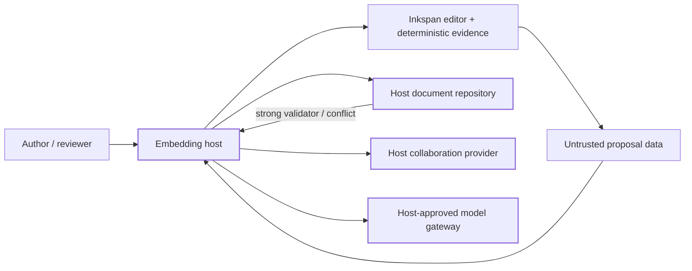

# Inkspan reference host

Status: Active PR / partial reference-host implementation

This directory is integration evidence for [issue #377](https://github.com/ContextualWisdomLab/inkspan/issues/377). It is intentionally **host code**, not a new Inkspan runtime surface or a production application. Protected `main` remains the shipped product authority. Final reference-host acceptance still requires the complete documented journey against the integrated protected artifact selected by #118.

The current slice contains deterministic host fixtures and helpers, public-package presentation entrypoints, a buyer-facing native-form component, an SSR/hydration gate, exact-packed application-level SSR evidence, and exact-packed-artifact package/browser verification:

- `synthetic-document-repository.mjs` demonstrates host-owned strong-validator / `If-Match` persistence behavior. `ambiguous_failure` models a pre-commit failure, while `ambiguous_commit_failure` commits durable state but returns the same ambiguous error without a replacement validator. After either ambiguous outcome, re-read durable state before retrying instead of advancing or blindly reusing the caller's last known validator. A stale validator returns a conflict. A confirmed failure can be retried with the unchanged current validator. A restore is a normal confirmed save against the current validator and advances it only after success. A fork requires the current validator, copies the current document into an independent reference repository, and starts that fork at a fresh validator.
- `delayed-proposal.mjs` demonstrates a provider-free delayed proposal captured against one expected revision. If the current revision changes before application, the proposal returns a conflict instead of overwriting newer content. Host apply callback failures are normalized to a stable payload-free error rather than reflecting private causes through the proposal boundary.
- `autosave-view-model.mjs` projects Inkspan autosave lifecycle snapshots into host-localizable `clean`, `saving`, `queued`, `conflict`, `failed`, `retrying`, `recovered`, `closing`, and `closed` presentation states. Recovery presentation is derived from observed blocked → saving → idle transitions, and validators are never returned as UI data.
- `autosave-recovery-host.tsx` connects the actual editor to the public durable autosave session and the existing in-memory repository. Edit to save automatically; delay confirmation to see newer edits queue; simulate failures or a competing author, then use the recovery controls without discarding the local draft. A reread confirms ambiguous writes before retrying. Matching committed content is not written twice. Conflicts can be saved as an independent copy, after which subsequent edits target that copy and leave the original unchanged. Captures that finish hashing out of order cannot replace newer edits. The host resets its presentation projection when it replaces a blocked session; it does not relabel an old session's retry as a new session's recovery.
- `collaboration-provider-lifecycle.mjs` demonstrates that the embedding host creates one real `Y.Doc`, reuses that same document across provider reconnects, owns provider/document teardown, and replaces a provider whose `connect()` threw rather than retrying an indeterminate resource. The deterministic provider fixture has no provider SDK or network transport and does not treat room or actor identifiers as authorization evidence.
- `host-authorized-collaboration.mjs` demonstrates a host-owned synchronous admission gate around provider construction. The authorization callback receives only bounded room, actor, and provider-generation identity; only the exact boolean `true` admits construction; thrown, asynchronous, false, or otherwise indeterminate decisions fail closed with a payload-redacted error. The host re-authorizes every provider generation before the host-owned `Y.Doc` reaches the provider constructor. This reference adapter contains no production identity service, credential store, provider SDK, or network transport and does not make Inkspan an authorization authority.
- `single-flight-submission.ts` provides the synchronous host-local admission guard used by the form example so same-turn submit/reset races cannot invoke the durable host callback twice.
- `hydration-gate.tsx` demonstrates an application-facing client hydration gate around the public Inkspan editor contract. It is deterministic boundary evidence, not a complete framework application or browser acceptance journey.
- `reference-host-client.tsx` is the narrow `'use client'` composition boundary: it owns the hydration gate plus native-form editor lifecycle while leaving authorization and durable persistence behind the injected host callback.
- `reference-host-app.tsx` is the server-safe deterministic application shell. It renders host chrome and delegates all browser-only editor behavior to `reference-host-client.tsx`; this remains source-contract evidence rather than complete framework/browser acceptance.
- `browser-host.tsx` loads the local `presentation-full.css` entrypoint and hydrates the deterministic `browser-host.html` shell into the native-form or save-recovery journey. The browser harness binds the editor, autosave, CSS, and bundled fonts to an extracted exact tarball for Chromium/Firefox/WebKit verification. Its in-memory readbacks are local test evidence, not an authorized durable host or final #377 acceptance.
- `presentation-full.css` imports Inkspan's public `styles.css` and complete multilingual `fonts.css` subpaths for hosts that want the bundled offline multilingual font set.
- `presentation-latin.css` imports the same public editor stylesheet plus the smaller public `fonts-latin.css` option for Latin-only hosts.
- `native-form-host.tsx` demonstrates public-package native-form integration: Inkspan synchronizes `message_body` through `formFieldName`, reset behavior is expressed through `formResetValue`, the host reads `FormData` only on submit, and authorization plus durable persistence remain behind the injected `onAuthorizedSubmit` host boundary rather than being embedded in the component.
- `office-handoff.mjs` maps bounded editor Markdown through Inkspan's public React-free Markdown projection into the strict DOCX paragraph-request shape expected by the Office component. It does not render Office bytes, authorize export, choose an output path, persist or distribute artifacts, use network/credential state, or claim Markdown-to-OOXML round-trip fidelity; those remain Office/host responsibilities.
- `verify-office-handoff.mjs` consumes an already extracted exact package entry supplied by repository verification orchestration through `INKSPAN_BROWSER_PACKAGE_ENTRY`, maps bounded Markdown through that public React-free package handoff, renders the request through the local Inkspan Office CLI, validates the resulting DOCX title/body, and removes its temporary output. It does not build, pack, or choose the artifact itself. This is deterministic component-execution evidence only: host export authorization, output-location policy, durable storage, distribution, and broader document-fidelity acceptance remain outside the example's authority.
- `verify-packed-office-journey.mjs` is the self-contained package-authority wrapper for that bounded Office path: `--self-test` builds and packs the current Inkspan source, extracts the exact tarball into an isolated consumer-shaped package root, binds `verify-office-handoff.mjs` to that public package entry, runs the bounded DOCX rendering/validation, and removes the temporary consumer; `--plan` reports the exact-packed-tarball authority without executing it. It still assumes the repository's local Office Python dependencies are installed and makes no production export/storage/distribution claim.
- `verify-packed-artifact.mjs` builds and packs the current Inkspan source, installs that exact tarball into an isolated consumer, proves public ESM/CommonJS/SSR and React-free subpath consumption plus CSS/font resolution, exercises exact packed autosave observer wiring into the host lifecycle projection, and rejects source-tree authority leakage. This is exact package-consumer evidence, not a complete buyer framework application.
- `verify-application-ssr.mjs` builds and packs the current Inkspan source, installs that exact tarball plus host-owned React/ReactDOM dependencies into an isolated buyer-shaped consumer, binds the real `ReferenceHostApp` application shell to the installed packed public entry, server-bundles it with Vite, and requires deterministic host chrome plus a deferred client-editor hydration boundary. The host submit callback must not execute during server rendering and the client-only `message_body` field must not cross the server boundary. The verifier removes its temporary consumer after execution. This is exact-packed application-level SSR evidence, not a complete Next.js or other production framework host.
- `verify-browser-journey.mjs` builds and packs the current Inkspan source, installs that exact tarball and its declared dependencies into an isolated temporary consumer, binds the browser harness to the installed public entries and consumer-owned React peers, and runs the reference-host specs across Chromium, Firefox, and WebKit. Extracting an archive alone is insufficient: the package deliberately externalizes dependencies. Sharing the installed consumer's React and ReactDOM prevents a second hook runtime in the host. `--plan` reports the engines/spec inventory; `--self-test` runs the scoped journey and reports the tarball SHA-256 plus successful dependency installation. The verifier requires the repository's isolated browser-test dependencies and pinned browsers, makes no production transport/auth/persistence claim, and removes its temporary consumer after the run.
- `verify-current-reference-journey.mjs` is the single entrypoint for the **currently implemented partial** journey. `--plan` emits the exact ordered verification contract without running it; the default invocation runs the deterministic repository/proposal/autosave/collaboration checks followed by exact packed-artifact, application SSR, bounded Office, and scoped exact-packed real-browser verification. It does not claim final #377 acceptance or production host integration.

Executable fixtures and helpers remain reference-only host code, require no service, database, credential, provider SDK, model, or external runtime connection for their deterministic repository checks, and are exercised by repository tests. The browser verifier uses only the local loopback harness at runtime and its browser specs reject unexpected external requests. The presentation/native-form/hydration examples reference only public package entrypoints. The complete reference-host directory is deliberately outside the package `files` inventory so example host logic cannot silently become published Inkspan runtime authority.

## Copy this, replace that

| Reference element | Buyer action |
| --- | --- |
| synthetic document repository | Replace with an authorized atomic durable store that enforces the host's RFC 9110 `If-Match` policy, preserves caller validators across confirmed failures, reconciles authoritative state after ambiguous transport outcomes, supports explicit retry/restore/fork recovery under current-validator checks, isolates fork history, and returns a new strong validator only after confirmed success. |
| deterministic delayed proposal | Replace proposal generation with a host-approved model gateway and data-use policy while preserving exact-revision conflict checks and payload-redacted callback-failure handling before applying untrusted proposal data. |
| autosave presentation projection | Preserve the exact packed autosave observer-to-view-model boundary in localized host UI; connect authenticated recovery actions in host code and do not display revision or durable validators as user-facing status. |
| collaboration lifecycle and authorization fixtures | Keep host-owned `Y.Doc` lifecycle control and per-generation fail-closed authorization placement. Replace the deterministic `authorize` callback and provider factory with the host's authenticated policy decision and authorized Yjs transport provider while preserving ambiguous-connect replacement, reconnect, teardown, credential, and room-authorization policy. Credentials and durable authorization evidence remain host-owned and must not enter Inkspan runtime authority. |
| presentation entrypoints | Choose the complete multilingual or Latin-only font entrypoint, keep imports on published package subpaths, and apply any host theme overrides without weakening Inkspan accessibility states. |
| native form host | Keep Inkspan's `formFieldName` / `formResetValue` serialization boundary, then connect `onAuthorizedSubmit` to host-owned authorization and atomic durable persistence. Do not add a second hidden-field serializer or treat submitted form content as authorization evidence. |
| Office handoff helper | Keep the provider-neutral public Markdown projection/request mapping or replace it with a host-approved richer mapping; invoke the strict Inkspan Office renderer only behind host-owned export authorization, output-location policy, storage, and distribution. |
| exact packed-artifact verifier | Preserve exact-tarball build/install/SSR/autosave-observer/package-resolution and real-browser presentation checks in buyer CI, then add the complete framework application journey rather than treating repository test-host success as product acceptance. |
| synthetic document and revision identifiers | Replace with authenticated/authorized host context; never infer tenant or actor authority from an Inkspan digest, form value, or example identifier. |
| reference error handling | Map stable machine outcomes to localized host UX and audited host operations without copying document bodies, prompts, credentials, or private causes into generic telemetry. |

## Ownership map



Inkspan owns deterministic editor/revision/autosave/conversion/package behavior. The host owns authenticated transport, authorization, tenancy, durable persistence, `Y.Doc` and collaboration-provider lifecycle, credentials, model policy, retention, deployment, and durable audit. A successful local editor operation, native-form submission, Yjs update, model response, or status check is not durable authorization or persistence evidence.

## Executable fixture checks

### Interactive save recovery

After the repository's pinned dependencies are installed, build and open the local reference host:

```sh
pnpm build
pnpm exec vite --config tests/browser/vite.config.ts --host 127.0.0.1 --port 4173 --strictPort
```

Open `http://127.0.0.1:4173/examples/reference-host/browser-host.html?journey=recovery`.
The default URL still opens the native-form journey; add `&readOnly=1` to the recovery URL for its read-only state. Add `&savedDraft=1` to open a previously saved rich-text fixture, or `&savedDraft=invalid` to exercise an unreadable stored draft. The editor restores the saved document before enabling editing or autosave; an unreadable document remains untouched with editing disabled. This development preview resolves public package exports from the local build. The verifier below binds the editor, autosave subpath, CSS, and fonts to an extracted exact tarball; development-preview success alone is not packed-artifact evidence.

The screen keeps the existing editor and bundled Noto Sans presentation, uses native controls, announces save outcomes, and separates demo failure controls from recovery actions. No new UI framework, service, or dependency is introduced. Copy and retry admission is synchronous, independent of the next React render. Demo controls are absent in print; the draft remains readable at 320px and with forced colors.

This is an English-language, single-document, synthetic example, not a localized production application or a latency benchmark. The existing repository limits each stored document to 65,536 code units. Recovery copy creation and registration are synchronous here; an asynchronous production host must preserve the copy and draft until authorized durable saving and registration are confirmed. All contents disappear on reload or tab close, as the screen states. Hosts must supply their own localization, authorization, transport, persistence, retention, and audit policy.

The browser acceptance checks use actual editing and controls across Chromium, Firefox, and WebKit. They check queued latest-edit saving, confirmed and ambiguous failures before/after commit, reread-before-retry, fork isolation, same-turn retry admission, a competing write after reread, out-of-order digest settlement, read-only behavior, keyboard recovery, forced colors, 320px layout, print, and absence of external requests. A failed capture remains visibly unsaved even when an older save finishes; shortening the draft permits a new save. The synthetic saved-copy readback is test-host evidence only, never a production endpoint.

From a repository checkout with the supported Node runtime, root and isolated browser-test dependencies, pinned Playwright browser revisions, and the dependencies required by the exact packed-artifact and local Office verification already installed, the currently implemented partial reference journey can be exercised with one command:

```sh
node examples/reference-host/verify-current-reference-journey.mjs
```

Its deterministic execution plan can be inspected without running the constituent checks:

```sh
node examples/reference-host/verify-current-reference-journey.mjs --plan
```

The constituent deterministic reference-only fixture checks remain directly executable when a narrower causal check is needed:

```sh
node examples/reference-host/synthetic-document-repository.mjs --self-test
node examples/reference-host/delayed-proposal.mjs --self-test
node examples/reference-host/autosave-view-model.mjs --self-test
node examples/reference-host/collaboration-provider-lifecycle.mjs --self-test
node examples/reference-host/verify-application-ssr.mjs --self-test
node examples/reference-host/verify-packed-office-journey.mjs --plan
node examples/reference-host/verify-packed-office-journey.mjs --self-test
node examples/reference-host/verify-browser-journey.mjs --plan
node examples/reference-host/verify-browser-journey.mjs --self-test
```

The repository test suite independently exercises those fixtures plus the host-authorization, hydration/native-form/single-flight/Office-handoff contracts, runs `verify-packed-artifact.mjs` to build, pack, install, and consume the exact current tarball in an isolated consumer, and runs `verify-application-ssr.mjs` to install the same exact current package authority into a buyer-shaped application SSR consumer. The application-level SSR verifier binds the real server-safe reference-host shell to the installed packed editor, requires deterministic host chrome, proves the client editor remains behind the hydration gate, and proves host submit authority is not invoked during server rendering. The one-command helper invokes `verify-packed-office-journey.mjs` after the packed-artifact consumer check and then `verify-browser-journey.mjs`, so the currently implemented partial buyer journey supplies exact tarball authority to both the bounded Office path and the reference-host-only Playwright acceptance. The cross-engine Playwright suite additionally builds and extracts the exact tarball, binds the package root plus public styles/font subpaths to that artifact, and exercises the repository browser-test host shell with real native-form hydration/submission, deterministic read-only and delayed-submission transitions, a 320px narrow-viewport journey, print media, forced colors, and no-unexpected-network acceptance across Chromium, Firefox, and WebKit. The read-only journey proves the editor remains readable while its hidden native form field, Save action, Reset action, and host submission callback all fail closed. The narrow-viewport journey requires the editor and Save/Reset controls to remain visible and in-viewport while rejecting document or body horizontal overflow. The print journey requires the toolbar to be absent from print presentation, checks the package print overflow/border/surface/content contract, and rejects external runtime requests. The suite also asserts stale-write conflict, failure-safe retry, ambiguous pre-commit and post-commit reconciliation, restore, fork isolation, lifecycle recovery, exact packed-package autosave observer-to-host-view-model integration, real host-created `Y.Doc`, provider replacement after ambiguous connect failure, reconnect/teardown, per-generation host authorization before provider construction, exact-synchronous-true admission, authorization-failure redaction, proposal-failure redaction, full public presentation-package behavior, native-form published-package/host-authority boundaries, the bounded React-free Markdown-to-DOCX-request mapping, deterministic exact-packed Office rendering/validation through `verify-packed-office-journey.mjs`, exact-packed application-shell SSR, and exact package authority. These checks do **not** yet satisfy #377's complete packed-artifact framework-application acceptance. The verified Office journey is intentionally bounded to the documented Markdown subset and local renderer contract; broader fidelity and production export operations remain host-owned acceptance work.

The one-command helper above consolidates only the currently implemented reference-host checks. It is **not** final #377 acceptance: the collaboration and delayed-proposal helpers still need their complete interactive application journey, and final verification must consume the integrated protected release artifact.

## Deliberate omissions in this partial slice

Still required before #377 can close: a complete reference-host application must connect and verify the remaining collaboration lifecycle and stale-proposal paths, exercise explicit restore alongside the existing fork recovery and bounded Office handoff, and pass the full clean-checkout journey against the protected artifact selected by #118. Next.js, production credentials, a live collaboration service, and a durable database are not requirements of #377; the issue explicitly permits replaceable synthetic adapters. Those production responsibilities remain with the embedding host.

Do not use the synthetic repository, synthetic identifiers, deterministic proposal fixture, presentation projection, deterministic collaboration provider, host-authorization adapter, hydration gate, native-form example callback, or Office request helper as a production persistence, authentication, authorization, collaboration, model, deployment, export-authorization, storage, or distribution implementation.
